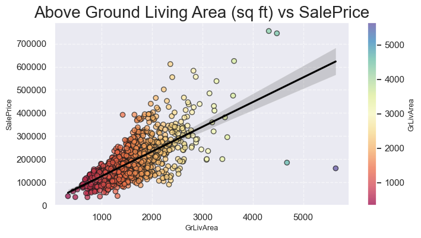
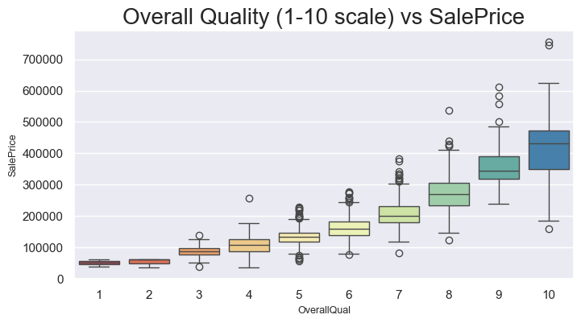
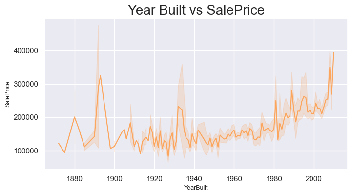
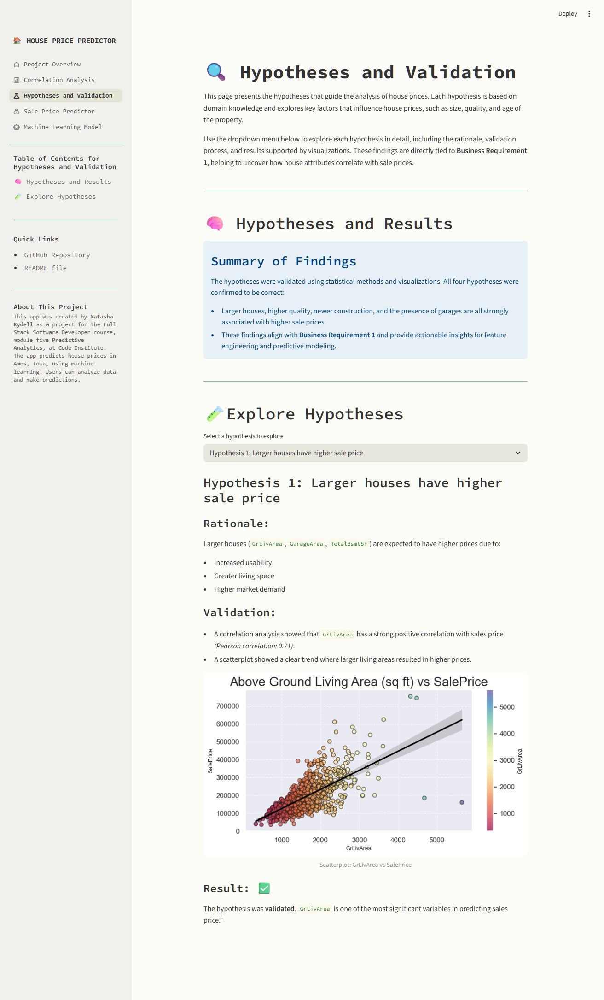
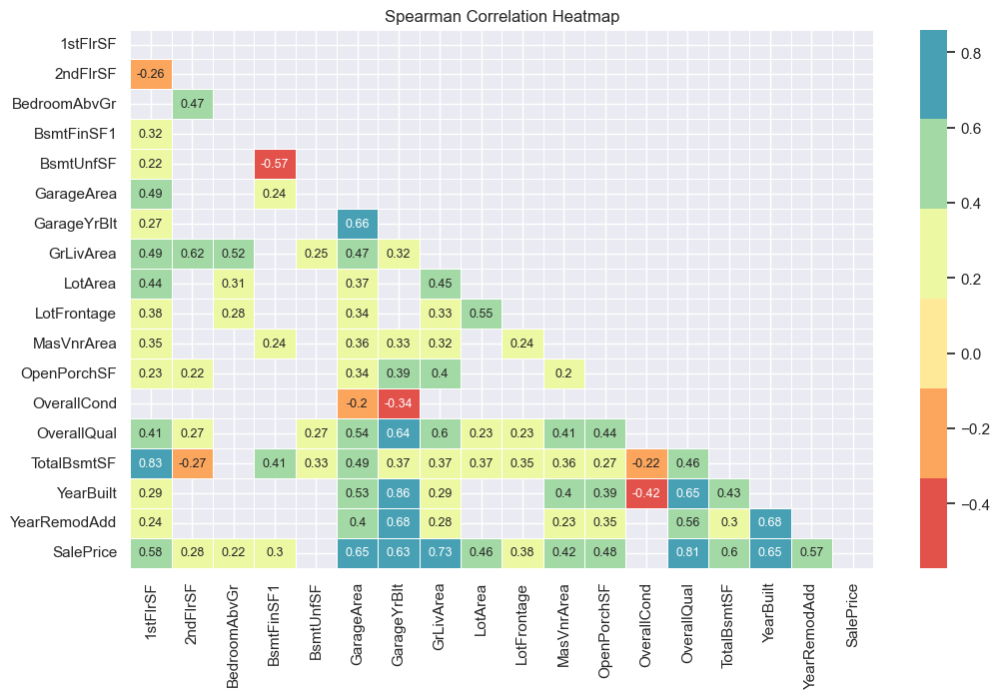
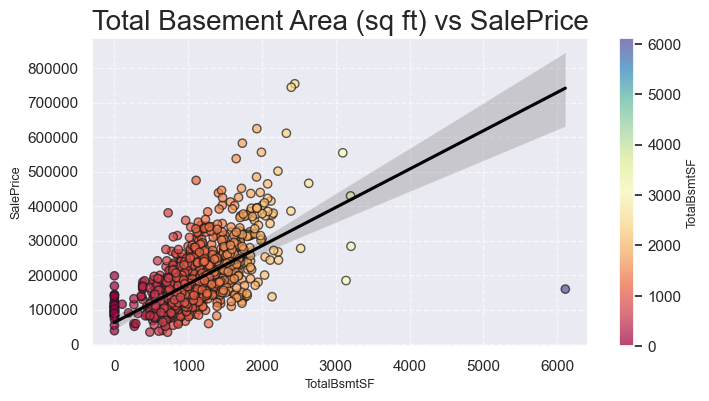

# House Pricing Predictor

The **House Pricing Predictor** is an interactive dashboard designed to analyze housing data from Ames, Iowa, and predict house sale prices. This project combines data analysis, machine learning, and interactive visualizations to provide actionable insights for homeowners, real estate agents, and property investors.

### Key Features:
- **Data-Driven Decisions**: Empower users to make informed decisions about property pricing based on data insights.
- **Insightful Analysis**: Explore the factors that most strongly influence house prices, such as size, quality, and age.
- **Real-Time Predictions**: Predict house sale prices instantly, reducing uncertainty and saving time.

By following a structured methodology ([CRISP-DM](#crisp-dm-a-structured-approach)) and leveraging advanced machine learning techniques, this project delivers accurate predictions and valuable insights tailored to the needs of its users.

[**Try the Dashboard Here**](https://pp5-sales-price-predictor.onrender.com)


## Table of Contents
1. [**House Pricing Predictor**](#house-pricing-predictor)
2. [**Terminology**](#terminology)
3. [**CRISP-DM: A Structured Approach**](#crisp-dm-a-structured-approach)
   - [Summary of CRISP-DM Phases and Their Purpose](#summary-of-crisp-dm-phases-and-their-purpose)
   - [Detailed Explanation of Each Phase](#detailed-explanation-of-each-phase)
4. [**Dataset Content**](#dataset-content)
5. [**Business and Dashboard Requirements**](#business-and-dashboard-requirements)
6. [**Hypotheses and Validation Process**](#hypotheses-and-validation-process)
   - [Hypothesis 1: Larger houses have higher sale price](#hypothesis-1-larger-houses-have-higher-sale-price)
   - [Hypothesis 2: Houses with higher overall quality have higher sale price](#hypothesis-2-houses-with-higher-overall-quality-have-higher-sale-price)
   - [Hypothesis 3: Newer houses have higher sale price](#hypothesis-3-newer-houses-have-higher-sale-price)
   - [Hypothesis 4: Houses with garages have higher sale price](#hypothesis-4-houses-with-garages-have-higher-sale-price)
7. [**Agile Methodology: EPICS and User Stories**](#epics-and-user-stories)
8. [**Technical Implementation of Business Requirements**](#technical-implementation-of-business-requirements)
9. [**ML Business Case**](#ml-business-case)
   - [Problem Definition](#1-problem-definition)
   - [Objectives](#2-objectives)
   - [Solution](#3-solution)
   - [Business Value](#4-business-value)
   - [Model Performance](#5-model-performance)
   - [Agile Development Approach](#6-agile-development-approach)
   - [Business Case Assessment](#7-business-case-assessment)
10. [**Dashboard Design**](#dashboard-design)
    - [Sidebar](#sidebar)
    - [Quick Summary](#quick-summary)
    - [Correlations Analysis](#correlations-analysis)
    - [Hypothesis and Validation](#hypotheses-and-validation)
    - [Sale Price Predictor](#sale-price-predictor)
    - [Machine Learning Model](#machine-learning-model)
11. [**Plots**](#plots)
    - [Histogram](#histogram)
    - [Heatmaps](#heatmaps)
    - [Box Plots](#box-plots)
    - [Line Plots](#line-plots)
    - [Linear Model Plots](#linear-model-plots)
    - [Regression Performance Plot](#regression-performance-plot)
12. [**Testing and Bugs**](#testing-and-bugs)
    - [Testing Overview](#testing-overview)
    - [Code Quality Testing with PEP8](#code-quality-testing-with-pep8)
    - [Functional Testing](#functional-testing)
    - [Responsive Testing](#responsive-testing)
    - [EPICS and User Stories Testing](#epics-and-user-stories-testing)
    - [Model Unit Testing](#model-unit-testing)
    - [Jupyter Notebook Testing](#jupyter-notebook-testing)
13. [**Bugs**](#bugs)
    - [Bugs Identified During Development](#bugs-identified-during-development)
	- [Bugs Identified After Deployment](#bugs-identified-after-deployment)
14. [**Future Improvements**](#future-improvements)
15. [**Deployment**](#deployment)
16. [**Technologies and Python Packages**](#technologies-and-python-packages)
17. [**Why We Chose the New Streamlit Approach**](#why-we-chose-the-new-streamlit-approach)
	- [Key Reasons for This Choice](#key-reasons-for-this-choice)
	- [Streamlit Theme Customizations](#streamlit-theme-customizations)
	- [Exampel of `config.toml`](#example-of-configtoml)
	- [Why Not Use `multipage.py`?](#why-not-use-multipagepy)
17. [**Credits**](#credits)
	- [Content](#content)
	- [Media](#media)
18. [**Acknowledgements**](#acknowledgements)

## Terminology

This section provides definitions for key terms and concepts used throughout the project to ensure clarity and accessibility for all readers.

- **CRISP-DM**: A standardized process model for data mining projects, consisting of six phases: Business Understanding, Data Understanding, Data Preparation, Modeling, Evaluation, and Deployment.
- **R² (R-squared)**: A statistical measure that represents the proportion of the variance for a dependent variable that's explained by an independent variable or variables in a regression model. Higher values indicate better model performance.
- **MAE (Mean Absolute Error)**: A metric used to measure the average magnitude of errors in a set of predictions, without considering their direction.
- **MSE (Mean Squared Error)**: A metric that measures the average squared difference between predicted and actual values. It penalizes larger errors more than smaller ones.
- **RMSE (Root Mean Squared Error)**: The square root of the MSE, providing an interpretable measure of error in the same units as the target variable.
- **Feature Engineering**: The process of transforming raw data into features that better represent the underlying problem to the predictive models, improving their performance.
- **Hyperparameter Tuning**: The process of optimizing the parameters of a machine learning model to improve its performance.
- **Streamlit**: An open-source Python library used to create interactive web applications for data science and machine learning projects.
- **Correlation**: A statistical measure that describes the strength and direction of a relationship between two variables.
- **Heatmap**: A graphical representation of data where individual values are represented by varying colors, often used to visualize correlations.
- **Regression Model**: A type of predictive modeling technique that estimates the relationship between a dependent variable (target) and one or more independent variables (features).
- **Pearson Correlation**: A measure of the linear relationship between two variables, ranging from -1 (perfect negative correlation) to 1 (perfect positive correlation).
- **Spearman Correlation**: A non-parametric measure of rank correlation, assessing how well the relationship between two variables can be described using a monotonic function.
- **Predictive Power Score (PPS)**: A metric that quantifies the predictive strength of one variable for another, regardless of their linear or non-linear relationship.
- **Winsorization**: A statistical technique used to limit extreme values in the data to reduce the effect of outliers.
- **Dashboard**: An interactive interface that provides visualizations, insights, and tools for users to explore data and generate predictions.

## CRISP-DM: A Structured Approach

CRISP-DM (CRoss Industry Standard Process for Data Mining) is a standardized process model used to structure data analytics projects. It provides a clear roadmap for tackling complex data problems, ensuring that the project is well-organized and meets business requirements. This methodology was applied throughout the project to deliver a reliable and actionable solution.

### Summary of CRISP-DM Phases and Their Purpose

The table below provides a high-level overview of the six CRISP-DM phases and their purpose in this project:

| **Phase**              | **Explanation**                                                                 |
|-------------------------|---------------------------------------------------------------------------------|
| **Business Understanding** | Ensures the project is aligned with the client's goals and provides a clear roadmap for the analysis. |
| **Data Understanding**  | Focuses on exploring and understanding the dataset to identify key variables and patterns. |
| **Data Preparation**    | Involves cleaning, transforming, and preparing the data for analysis and modeling. |
| **Modeling**            | Builds and optimizes machine learning models to meet the business requirements. |
| **Evaluation**          | Assesses the model’s performance to ensure it meets the client's expectations. |
| **Deployment**          | Delivers the final solution to the client, including a user-friendly dashboard. |


### Detailed Explanation of Each Phase

1. **Business Understanding**
	- **Objective**: Understand the client’s needs and define the business requirements. The client wants to:
		1. Identify which house attributes correlate most strongly with sales price.
		2. Predict the sales price of four inherited and second-hand houses in Ames, Iowa.
	- **Results**: The business requirements were mapped to two main tasks:
		- Perform data analysis and visualization to identify correlations.
		- Build a machine learning model to predict sales prices.

2. **Data Understanding**
	- **Objective**: Explore and understand the dataset.
	- **Actions**:
		- The dataset was downloaded from [Kaggle](https://www.kaggle.com/codeinstitute/housing-prices-data).
		- An initial analysis was performed to identify key variables and understand the data distribution.
	- **Results**: Variables such as `GrLivArea`, `GarageArea`, `KitchenQual`, and `OverallQual` were identified as potentially highly correlated with sales price.

3. **Data Preparation**
	- **Objective**: Prepare data for analysis and modeling.
	- **Actions**:
		- Handling missing values (e.g., imputation of `LotFrontage`).
		- Creation of new features (e.g., log-transformation of `SalePrice` to handle skew).
		- Splitting data into training and testing sets.
	- **Result**: A clean and structured dataset ready for analysis and modeling.

4. **Modeling**
	- **Objective**: Build and optimize a machine learning model.
	- **Actions**:
		* A regression model, **ExtraTreesRegressor**, was selected based on the business requirements and its ability to handle both linear and non-linear relationships.
		* Hyperparameter optimization was performed using GridSearchCV to improve the model’s performance.
		* The model was trained with the identified best features: `GarageArea`, `GrLivArea`, `KitchenQual` and `OverallQual`.
	- **Result**: 
		- R² (Train Set): 0.809
		- R² (Test Set): 0.793
		- The model exceeded the client's expectations by achieving an R² score of 0.793 on the test set, surpassing the minimum requirement of 0.75.

5. **Evaluation**
	- **Objective**: Evaluate the model’s performance and ensure that it meets the business requirements.
	- **Actions**:
		- The model’s performance was evaluated using R² scores and residual plots.
		- The results were compared with the customer’s requirement of an R² score of at least 0.75.
	- **Result**: The model met and exceeded the customer’s requirements.

6. **Deployment**
	- **Objective**: Deploy the solution to the customer.
	- **Actions**:
		- A Streamlit app was developed to visualize data and enable real-time predictions.
		- The app was deployed via [Render](https://render.com).
	- **Result**: The customer can now use the app to analyze data and predict sales prices. [Try the app here](https://pp5-sales-price-predictor.onrender.com).

### Conclusion

By following the CRISP-DM methodology, this project ensured a structured and systematic approach, resulting in a reliable and actionable solution for the client.


## Dataset Content
- The dataset is sourced from [Kaggle](https://www.kaggle.com/codeinstitute/housing-prices-data). We then created a fictitious user story where predictive analytics can be applied in a real project in the workplace.
- The dataset has almost 1.5 thousand rows and represents housing records from Ames, Iowa, indicating house profile (Floor Area, Basement, Garage, Kitchen, Lot, Porch, Wood Deck, Year Built) and its respective sale price for houses built between 1872 and 2010.

|Variable|Meaning|Units|
|:----|:----|:----|
|1stFlrSF|First Floor square feet|334 - 4692|
|2ndFlrSF|Second-floor square feet|0 - 2065|
|BedroomAbvGr|Bedrooms above grade (does NOT include basement bedrooms)|0 - 8|
|BsmtExposure|Refers to walkout or garden level walls|Gd: Good Exposure; Av: Average Exposure; Mn: Minimum Exposure; No: No Exposure; None: No Basement|
|BsmtFinType1|Rating of basement finished area|GLQ: Good Living Quarters; ALQ: Average Living Quarters; BLQ: Below Average Living Quarters; Rec: Average Rec Room; LwQ: Low Quality; Unf: Unfinshed; None: No Basement|
|BsmtFinSF1|Type 1 finished square feet|0 - 5644|
|BsmtUnfSF|Unfinished square feet of basement area|0 - 2336|
|TotalBsmtSF|Total square feet of basement area|0 - 6110|
|GarageArea|Size of garage in square feet|0 - 1418|
|GarageFinish|Interior finish of the garage|Fin: Finished; RFn: Rough Finished; Unf: Unfinished; None: No Garage|
|GarageYrBlt|Year garage was built|1900 - 2010|
|GrLivArea|Above grade (ground) living area square feet|334 - 5642|
|KitchenQual|Kitchen quality|Ex: Excellent; Gd: Good; TA: Typical/Average; Fa: Fair; Po: Poor|
|LotArea| Lot size in square feet|1300 - 215245|
|LotFrontage| Linear feet of street connected to property|21 - 313|
|MasVnrArea|Masonry veneer area in square feet|0 - 1600|
|EnclosedPorch|Enclosed porch area in square feet|0 - 286|
|OpenPorchSF|Open porch area in square feet|0 - 547|
|OverallCond|Rates the overall condition of the house|10: Very Excellent; 9: Excellent; 8: Very Good; 7: Good; 6: Above Average; 5: Average; 4: Below Average; 3: Fair; 2: Poor; 1: Very Poor|
|OverallQual|Rates the overall material and finish of the house|10: Very Excellent; 9: Excellent; 8: Very Good; 7: Good; 6: Above Average; 5: Average; 4: Below Average; 3: Fair; 2: Poor; 1: Very Poor|
|WoodDeckSF|Wood deck area in square feet|0 - 736|
|YearBuilt|Original construction date|1872 - 2010|
|YearRemodAdd|Remodel date (same as construction date if no remodelling or additions)|1950 - 2010|
|SalePrice|Sale Price|34900 - 755000|


## Business and Dashboard Requirements

The success of this project depends on meeting the client's business and dashboard requirements. These requirements ensure that the solution is both actionable and user-friendly, addressing the client's need to maximize the value of their inherited properties in Ames, Iowa.

By addressing these requirements, the project delivers a comprehensive solution that combines data analysis, machine learning, and an interactive dashboard to meet the client's goals.

- **Business Requirement 1**: The client is interested in discovering how the house attributes correlate with the sale price. Therefore, the client expects data visualizations of the correlated variables against the sale price to show that.
- **Business Requirement 2**: The client is interested in predicting the house sale price from her four inherited houses and any other houses in Ames, Iowa.
- **Dashboard Requirements**: The client requires a dashboard that provides an overview of the project and dataset, highlights key correlations between house attributes and sale prices, and allows users to input house data for real-time price predictions. It should also display the predicted sale price for the 4 inherited houses, their total value, and include a technical page summarizing the model's performance and pipeline.


## Hypotheses and Validation Process

To meet the business requirements, we developed four hypotheses to explore how different house attributes affect sales price. These hypotheses were tested using correlation analysis and visualizations, providing insights into the most significant variables for the regression model.

### **Hypothesis 1**: Larger houses have higher sale price.
- **Rationale**: It is expected that houses with larger living area (`GrLivArea`, `GarageArea`, `TotalBsmtSF`) have higher prices due to their size and usability.
- **Validation**: 
	- A correlation analysis showed that `GrLivArea` has a strong positive correlation with sales price *(Pearson correlation: 0.71)*.
	- A scatterplot showed a clear trend where larger living area resulted in higher prices.

	

- **Results**: The hypothesis was validated. `GrLivArea` is one of the most significant variables in predicting sales price.
	
### **Hypothesis 2**: Houses with higher overall quality have higher sale price.
- **Rationale**: Houses with better construction quality and finish (`OverallQual`) are expected to have higher prices due to their durability, aesthetics and buyer appeal.
- **Validation**: 
	- A correlation analysis showed that `OverallQual` has a very strong positive correlation with sales price *(Pearson correlation: 0.79)*.
	- A boxplot showed that houses with higher construction quality consistently had higher prices.

	

- **Results**: The hypothesis was validated. `OverallQual` is one of the most decisive factors for the sales price.

### **Hypothesis 3**: Newer houses have higher sale price.
- **Rationale**: Newer houses (`YearBuilt`) are expected to have higher prices due to modern design, better materials and lower maintenance costs.
- **Validation**: 
	- A correlation analysis showed a positive correlation between `YearBuilt` and sales price *(Pearson correlation: 0.52)*.
	- A line plot showed that newer houses generally have higher prices.

	

- **Results**: The hypothesis was partially validated. Although newer houses have higher prices, the correlation is not as strong as for other variables.

### **Hypothesis 4**: Houses with garages have higher sale price.
- **Rationale**: Houses with garages (`GarageArea`) are more attractive because they offer extra storage and parking space, which increases value.
- **Validation**: 
	- A scatterplot showed a positive trend between `GarageArea` and sales price *(Pearson correlation: 0.62)*.
	- Houses with larger garage areas generally had higher prices.

	

- **Results**: The hypothesis was validated. `GarageArea` affects sales price, but not as strongly as `GrLivArea` or `OverallQual`.


## EPICS and User Stories

This project was developed by following a structured approach based on Epics and User Stories. Each Epic represents a major phase of the project, while the User Stories break down the tasks into actionable steps. All Epics and User Stories have been addressed throughout the project to ensure that the client's requirements are met.

You can find the detailed tracking and progress of these Epics and User Stories on GitHub: [Project Board on GitHub](https://github.com/users/NatashaRy/projects/4)

### **EPIC 1 - Information gathering and data collection**
- User Story (E1US01) - **As a data analyst**, I want to download the dataset from Kaggle so that I can start analyzing it.
- User Story (E1US02) - **As a data analyst**, I want to explore the structure of the dataset so that I can identify key variables. 
- User Story (E1US03) - **As a data analyst**, I want to document the business requirements so that I can ensure the project meets the client's need. 
 
### **EPIC 2 - Data visualization, cleaning and preparation**
- User story (E2US04) - **As a data analyst**, I want to clean the dataset by handling missing values and outliers so that it is ready for analysis.
- User story (E2US05) - **As a data analyst**, I want to perform a correlation analysis so that I can identify which variables have the most impact on the sale price. *(Business Requirement 1, Dashboard Requirements)*
- User story (E2US06) - **As a data scientist**, I want to create visualization of the correlations so that I can present insights to the user. *(Business Requirement 1, Dashboard Requirement)*

### **EPIC 3 - Model training, optimization and validation**
- User story (E3US07) - **As a data analyst**, I want to split the dataset into training and testing data so that I can evaluate the model's performance. 
- User story (E3US08) - **As a data analyst**, I want to build a regression model so that I can predict house prices. *(Business Requirement 2, Dashboard Requirement)*
- User story (E3US09) - **As a data analyst**, I want to optimize the model using hyperparameter tuning so that I can improve its performance. *(Business Requirement 2, Dashboard Requirement)*
- User story (E3US10) - **As a data analyst**, I want to evaluate the model using R² so that I can ensure it meets the performance requirements. *(Business Requirement 2, Dashboard Requirement)*

### **EPIC 4 - Dashboard planning, designing and development**
- User story (E4US11) - **As a user**, I want to see an overview page that describes the project and dataset so that I understand its purpose. *(Dashboard Requirement)*
- User story (E4US12) - **As a user**, I want to see which variables have the most impact on the sale price so that I can gain insights. *(Business Requirement 1, Dashboard Requirement)*
- User story (E4US13) - **As a user**, I want to input house data and get a real-time prediction of the sale price. *(Business Requirement 2, Dashboard Requirement)*
- User story (E4US14) - **As a user**, I want to see a technical page that shows the model's performance and pipeline so that I can understand how the model works. *(Business Requirement 2, Dashboard Requirement)*

### **EPIC 5 - Documentation and deployment**
- User story (E5US15) - **As a project reviewer**, I want to read a README.md file that describes the project so that I can understand its purpose.


## Technical Implementation of Business Requirements
To address the client's business requirements, we have implemented specific data analysis and machine learning solutions. This section outlines the technical approach used to meet each requirement.

1. **Business Requirement 1**: Identify how house attributes correlate with the sale price.
	- **Rationale**: To understand which factors most influence the sale price, a detailed correlation analysis is required. This helps the client make informed decisions about which attributes are most valuable.
	- **Mapping**:
		- Perform correlation analysis between house attributes and sale price.
		- Visualize the correlations using scatter plots, box plots, and heatmaps.
		- Identify the most correlated variables and present them in an interactive dashboard.
    - **Notebook**: [03 - Correlation Analysis Notebook and Visualization](https://github.com/NatashaRy/milestone-project-heritage-housing-issues/blob/main/jupyter_notebooks/03-CorrelationStudy.ipynb)
		
2. **Business Requirement 2**: Predict the sale price for the inherited houses and other houses in Ames, Iowa.
	- **Rationale**: By building a machine learning model, we can provide the client with accurate sale price predictions based on house attributes. This helps the client maximize the value of the inherited houses.
	- **Mapping**:
		- Train a regression model to predict sale prices.
		- Implement an interactive feature in the dashboard where users can input house attributes and get real-time predictions.
		- Display the predicted prices for the inherited houses and their total value.
    - **Notebook**: [05 - Model Training and Evaluation Notebook](https://github.com/NatashaRy/milestone-project-heritage-housing-issues/blob/main/jupyter_notebooks/05-ModelTraining.ipynb)
		
3. **Dashboard Requirements**:
	- **Rationale**: The dashboard serves as a central platform to present insights and predictions in a user-friendly way.
	- **Mapping**:
		- Create an overview page describing the project and dataset.
		- Implement pages for correlation analysis, hypothesis validation, and sale price predictions.
		- Include a technical page showing the model's performance and pipeline.


## ML Business Case

To meet the client's business requirements, we developed a machine learning solution using a regression model to predict sale prices based on house attributes. This approach was chosen because it allows for accurate predictions and provides actionable insights into the factors that most influence house prices.

By leveraging machine learning, the project ensures that the client can make data-driven decisions and maximize the value of their inherited properties.

### 1. Problem Definition
- The client needs to understand which factors influence the sale price and predict the sale price for their inherited houses.
- The challenge is that the client's current knowledge of property prices is insufficient for making accurate appraisals in Ames, Iowa.
- The client also requires a user-friendly dashboard to explore insights and generate predictions.

### 2. Objectives
- Identify the most relevant attributes that influence the sale price through data analysis and visualization.
- Build a machine learning model capable of predicting sale prices with high accuracy.
- Develop an interactive dashboard to present insights and allow real-time predictions for both the inherited houses and any other house in Ames, Iowa.

### 3. Solution
To address the client's needs, the following steps were implemented:
- **Data Analysis**: Conducted correlation studies to identify the most relevant variables influencing sale prices.
- **Feature Engineering**: Prepared the dataset by handling missing values, addressing outliers, and creating new features (e.g., log-transformation of skewed variables).
- **Model Training**: Trained a regression model, specifically an **ExtraTreesRegressor**, to predict sale prices. Hyperparameter optimization was performed using GridSearchCV to improve performance.
- **Dashboard Development**: Built an interactive dashboard using Streamlit, allowing users to:
  - Explore correlations between house attributes and sale prices.
  - Input house attributes to generate real-time predictions.
  - View the predicted sale prices for the 4 inherited houses and their total value.

### 4. Business Value
- **Data-Driven Decisions**: The client can make informed decisions about pricing and selling their inherited houses based on data insights.
- **User-Friendly Dashboard**: The dashboard provides an intuitive platform to explore data and generate predictions, saving time and reducing uncertainty.
- **Maximized Sales Price**: By identifying key factors influencing sale prices, the client can maximize the value of their inherited properties.

### 5. Model Performance
The model was evaluated using key metrics to ensure it meets the agreed performance criteria:

#### **Train Set**
- **R² Score**: 0.809
- **Mean Absolute Error (MAE)**: $21,887.23
- **Mean Squared Error (MSE)**: 1,139,899,653.43
- **Root Mean Squared Error (RMSE)**: $33,762.40

#### **Test Set**
- **R² Score**: 0.793
- **Mean Absolute Error (MAE)**: $23,600.74
- **Mean Squared Error (MSE)**: 1,586,891,756.46
- **Root Mean Squared Error (RMSE)**: $39,835.81

The model exceeded the client's expectations by achieving an **R² score of 0.793** on the test set, surpassing the minimum requirement of 0.75. These results demonstrate that the model is both accurate and reliable for predicting house sale prices.
A technical page in the dashboard displays these performance metrics alongside visualizations, such as residual plots and feature importance, to provide further insights into the model's behavior.

### 6. Agile Development Approach
To ensure the project was delivered efficiently and met the client's requirements, we adopted an [**agile methodology**](#epics-and-user-stories). The project was broken down into **EPICS** and **User Stories**, which were tracked and addressed iteratively. This approach allowed for continuous feedback and ensured that all business requirements were met.


### 7. Business Case Assessment
The following questions guided the development of the project:
- **What are the business requirements?**
  - Discover how house attributes correlate with sale prices.
  - Predict the sale prices for the 4 inherited houses and any other house in Ames, Iowa.
- **Can conventional data analysis answer any requirements?**
  - Yes, correlation analysis was used to investigate how house attributes are related to sale prices.
- **Does the client need a dashboard or an API endpoint?**
  - The client requires a dashboard.
- **What does the client consider a successful outcome?**
  - A study showing the most relevant variables correlated with sale prices.
  - A capability to predict the sale price for the inherited houses and other houses in Ames, Iowa.
- **What are the model's inputs and outputs?**
  - Inputs: House attribute information (e.g., `GrLivArea`, `GarageArea`, `KitchenQual`, `OverallQual`).
  - Output: Predicted sale price.
- **What are the performance criteria for the model?**
  - An R² score of at least 0.75 on both the train and test sets.
- **How will the client benefit?**
  - The client will maximize the sales price for the inherited properties and gain a deeper understanding of the factors influencing house prices.


## Dashboard Design
The dashboard for this project is built using Streamlit, an open-source Python library that allows for the rapid development of interactive web applications. Streamlit is particularly well-suited for data science and machine learning projects, as it enables seamless integration of data visualizations, widgets, and machine learning models into a user-friendly interface. The dashboard is designed to address the client's business requirements and provide actionable insights through interactive visualizations and predictive analytics.


### Sidebar
- **File name**: [`app.py`](https://github.com/NatashaRy/milestone-project-heritage-housing-issues/blob/main/app_pages/multipage.py)
- **Purpose**: The Streamlit Sidebar is designed to provide intuitive navigation and quick access to essential project details and features. It ensures that users can seamlessly explore the dashboard and interact with its functionalities. The sidebar is visible at all time.


**Content**:
- **Navigation**: Navigation with [Material Icons](#media).
- **Expanding sidebar arrow**: The top right of the sidebar contains an arrow to give the user the possibility to fold/unfold the sidebar. If the sidebar is expanded, the arrow will appear when hovering over the sidebar.
- **Adjustable Sidebar Widht**: Users can choose the width of the sidebar themselves by dragging it out or in on the page to enlarge or reduce it as needed.

### Project Overview
- **File name**: [`summary.py`](https://github.com/NatashaRy/milestone-project-heritage-housing-issues/blob/main/app_pages/summary.py)
- **Icon**: 🗒️
- **Purpose**: Provide an overview of the project, including its goals, dataset and business requirements.
- **State Business Requirements**: A clear statement of the business requirements.
	1. Identify the most relevant variables correlated with house sale price.
	2. Predict the sale price of the 4 inherited houses and any other house in Amen, Iowa.


**Content**:
- **Introduction**: Explains what the page is about.
- **Project Summary**: Summarizes the project and its goals.
- **Dataset Details**: Link to the Kaggle dataset and quick summary of dataset listing:
	- Number of rows
	- Number of columns
	- Target varible
	- Key variables
	- Dataset preview
- **Business Requirements**: Both project business requirements are listed with links to pages associated with them. 
- **Link to README**: Link to the README file on GitHub.
	
	
### Correlation Analysis
- **File name**: [`analysis.py`](https://github.com/NatashaRy/milestone-project-heritage-housing-issues/blob/main/app_pages/analysis.py)
- **Icon**: 📈
- **Purpose**: Address Business Requirement 1 by analyzing and visualizing the correlation between house attributes and sale prices.
- **State Business Requirement 1**: Clearly outline the requirement to identify variables correlated with sale prices.

 

**Content**:
- **Introduciton**: Explains what the page is about.
- *Optional* - **Checkbox to inspect raw dataset**: When checked a scrollable table with the 10 first rows of raw dataset is displayed.
- **Summary of Analysis**: Summary of what the correlation analysis contributed and conclusions along with information box.
	- **Information Box**: Listing 3 key observations from the correlations analysis.


  

   


- **Heatmaps**: Divided into two tabs; one for predefined heatmaps and one for create custom heatmap.
	- **Column 1 - Checkboxes to Display Predefined heatmaps**: When checked chosen heatmap is displayed, including:
		- Pearson Correlation Heatmap
		- Spearman Correlation Heatmap
		- PPS Matrix Heatmap
	- **Column 2 - Create Custom Heatmap**: Users can select their own variables for correlation analysis using the multiple choice dropdown menu.
- **Checkbox to Display Target Variable Distribution**: When checked a histogram with distrubution of `SalePrice` is displayed.
- **Checkbox to Display Bivariate Analysis**: When checked several plots are displayed, showing the relationshop between key variables and the target variable.


### Hypotheses and Validation
- **File name**: [`hypotheses.py`](https://github.com/NatashaRy/milestone-project-heritage-housing-issues/blob/main/app_pages/hypotheses.py)
- **Icon**: 🔍
- **Purpose**: Present the hypotheses formulated during the project and describe how they were validated.

 

**Content**:
- **Introduction**: Explains what the page is about.
- **Hypotheses and Results**: Summary of the results we have reached when we have tested the hypotheses displayed in an information box.
- **Explore Hypotheses**: Dropdown that allows the user to select one of the four hypothesis to explore further.
- **Hypothesis**: Each hypothesis is described with:
	- **Rationale**: Explains the reasoning behind the hypothesis.
	- **Validation**: Describes the methods and analyses used to test it.
	- **Plot image**: Visualizes the relationship between variables.
	- **Result**: Summarizes whether the hypothesis was confirmed, partially confirmed, or rejected.


- **Dropdown to choose one of the hypotheses**:
	1. Larger houses have higher sale price *- confirmed.*
	2. Houses with higher overall quality have higher sale price *- confirmed.*
	3. Newer houses have higher sale price *- confirmed.*
	4. Houses with garages have higher sale price *- confirmed.*
- **Returns chosen hypothesis**.

### Sale Price Predictor
- **File name**: [`price_prediction.py`](https://github.com/NatashaRy/milestone-project-heritage-housing-issues/blob/main/app_pages/price_predictions.py)
- **Icon**: 💰
- **Purpose**: Address Business Requirement 2 by providing predictions for the 4 inherited houses and allowing users to predict prices for other houses.
- **State Business Requirement 2**: Clearly outline the requirement to predict house sale prices.


**Content**:
- **Introduction**: Explains what the page is about.
- **Reminder of business requirement 2**
- **Predict the sale price of inherited houses**: This section is divided into two subheadings, each providing tabs for users to choose how they want to view the data:
	1. **Inherited House Data**: Allows users to explore the raw data of the inherited houses.
		- **Tab 1 - Data Table**: Displays a full-width table with data filtered using the best features.
		- **Tab 2 - Chart**: Displays a full-width chart visualizing the data.
	2. **Predicted Sale Prices for Inherited Houses**: Focuses on the predicted sale prices for the inherited houses.
		- **Tab 1 - Data Table**: Displays a full-width table with the predicted sale prices.
		- **Tab 2 - Chart**: Displays a full-width chart visualizing the predicted sale prices.
- **Sum of total sale price for all inherited houses**.
- **Prediction of sale price of your own house**: Allows users to input specific house attributes and receive a predicted sale price based on the entered data.
	- **Input Widgets**: Users can provide the following house attributes using interactive widgets:
		- `GarageArea`: Size of the garage in square feet.
		- `GrLivArea`: Above-ground living area in square feet.
		- `KitchenQual`: Kitchen quality, selected from a dropdown menu.
		- `OverallQual`: Overall material and finish quality, selected on a scale from 1 to 10. Has a help box to explain 1=Poor and 10=Excellent quality.
	- **Question Mark Help**: `OverallQual` has each a help mark explaining what the steps are equal to in quality:
		- 1 = Poor
		- 3 = Fair
		- 5 = Typical/Average
		- 7 = Good
		- 10 = Excellent
	- Button labeled *"Predict Sale Price"*, to predict price based on user input.
		- Returns the predicted sale price based on the inputted house data from the user.

### Machine Learning Model
- **File name**: [`ml_pipeline_predictions.py`](https://github.com/NatashaRy/milestone-project-heritage-housing-issues/blob/main/app_pages/ml_pipeline_prediction.py)
- **Icon**: 🤖
- **Purpose**: Provide an overview of the machine learning model's performance and technical implementation.


**Content**:
- **Introduction**: Provides an overview of the page, explaining its purpose to present the machine learning model, its performance, and key insights.
- **Information box**: Summarizes the model training and evaluation process, including key metrics and highlights of the pipeline's performance.
- **Machine Learning Pipeline**: Displays the structure of the trained machine learning pipeline, outlining the steps involved in data preprocessing, feature selection, and prediction.
- **Feature Importance**: 
	- Highlights the most important features used by the model to make predictions.
	- Includes a visualization that shows the relative importance of each feature.
- **Model Performance**:
	- Evaluates the model's performance on both the training and test datasets.
	- Performance scores are displayed side by side in columns for easy comparison.
	- Metrics include:
		- Mean Absolute Error (MAE)
		- Mean Squared Error (MSE)
		- Root Mean Squared Error (RMSE)
		- R² (R-squared)
- **Regression Evaluation Plots**:
	- Visualizations that compare actual values and predicted values for both the training and test datasets.
	- Plots are displayed side by side for a clear comparison.

## Plots

### Histogram

The histogram shows the distribution of the sales prices (`SalePrice`) in the dataset. This gives an overview of how the prices are spread out and whether there are any clear peaks or outliers.


### Heatmaps

**Pearson Correlation Heatmap**: Visualizes linear relationships between variables and sales price. Higher values (close to 1 or -1) indicate strong relationships.


**Spearman Correlation Heatmap**: Visualizes strong monotonic relationships.



**Predictive Power Score (PPS) Heatmap**: Shows the predictive strength between variables and the target variable (`SalePrice`), which is useful for identifying important predictors.


### Box Plots
Box plots show how different categories (e.g., `KitchenQual` or `OverallQual`) affect the selling price. They help identify differences between groups.

*Price by Excellent Kitchen Quality*


*Price by Good Kitchen Quality*


*Price by Typical Kitchen Quality*


*Price by Overall Quality*


### Line Plots
The line charts show trends in sales prices over time, for example based on year built (`YearBuilt`) or year renovated (`YearRemodAdd`).

*Price by Year Built*


*Price by Year Remodeled/Added*


### Linear Model Plots
These charts show linear relationships between specific variables (e.g., `GrLivArea`, `GarageArea`) and sales price. They include a regression line to illustrate the trend.

*Price by First Floor Square Feet*


*Price by Garage Area*


*Price by Garage Year Built*


*Price by Ground Living Area*


*Price by Masonry Vaneer Area*


*Price by Total Basement Square Feet*



### Regression Performance Plot

Regression Performance Plot is a visualization that compares actual sales prices (`SalePrice`) to the predicted prices from the machine learning model.


## Testing

This section outlines the testing strategies implemented during the development and deployment of the project. A combination of automated and manual testing was conducted to ensure the functionality, reliability, and performance of the dashboard and machine learning model.

**Summary**:
- All tests passed successfully, confirming that the project meets the client's requirements.
- Key bugs were identified and resolved, ensuring a robust and error-free solution.

### Testing Overview

A combination of automated and manual testing was conducted to ensure the functionality, reliability, and performance of the dashboard and machine learning model. All tests passed successfully, confirming that the project meets the client's requirements and provides a robust solution.


| **Test Type** | **Objective** | **Testing Method** | **Result** |
|---------------------------|---------------------------|--------------------------|-----------------------|
| **Code Quality Testing** | Ensure all Python files comply with PEP8 guidelines. | Automated | Passed  |
| **Functional Testing** | Verify the functionality of the dashboard, including navigation and features.| Manual | Passed  |
| **Responsive Testing** | Ensure the dashboard is fully functional and visually appealing on various devices and screen sizes. | Manual/Simulated | Passed |
| **EPICS and User Stories Testing** | Validate that all EPICS and User Stories meet the business requirements. | Manual | Passed |
| **Model Unit Testing** | Ensure the machine learning model trains and predicts without errors. | Automated | Passed |
| **Notebook Testing** | Validate the execution of all steps in the Jupyter Notebooks. | Manual | Passed |


### Code Quality Testing with PEP8

All Python project files were rigorously checked using the CI Python Linter, accessible at [PEP8CI](https://pep8ci.herokuapp.com/). This tool was employed to verify that the code complies with PEP 8 guidelines, promoting uniformity, clarity, and adherence to best practices throughout the project. The automated linting process identified and resolved formatting inconsistencies, ensuring a clean and professional codebase.

**Files Tested**:
```
app.py 
multipage.py
summary.py
analysis.py
hypotheses.py
price_prediction.py
ml_pipeline_prediction.py	
prediction_analysis.py
evaluate_reg.py
data_management.py
```

### Functional Testing
The following tests were performed manually to ensure the functionality of the dashboard:

1. **Dataset Loading**: Verified that the dataset loads correctly without errors.
2. **Correlation Analysis**: Checked that the visualizations display the correct relationships between variables.
3. **Prediction Functionality**: Tested the prediction feature by inputting various house attributes and verifying the output.
4. **Dashboard Navigation**: Ensured that all pages in the dashboard are accessible and display the correct content.

**Result**: All manual tests passed successfully, confirming that the dashboard functions as intended.


### Responsive Testing

To ensure the dashboard is fully functional and visually appealing on various devices and screen sizes, the following tests were conducted:

**Summary of Tests:**
- **Navigation**: Verified that the sidebar is properly aligned, foldable/expandable, and functional across all devices.
- **Widgets**: Ensured that all input widgets (e.g., checkboxes, radio buttons, and prediction widgets) work as expected.
- **Visualizations**: Confirmed that all visualizations are scrollable, readable, and adjust correctly to different screen sizes.
- **Tables**: Verified that tables are scrollable and display data correctly on all devices.

#### **Desktop Testing**:

| **Screen Size** (px) | **Testing Method** | **Result** |
|-----------------------|--------------------|------------|
| 2650x1080            | Physical Device    | Passed     |
| 1920x1080            | Physical Device    | Passed     |

- Verified that the dashboard scales correctly on large screens.

#### **Tablet Testing**:

| **Model**            | **Screen Size** (px) | **Testing Method** | **Result** |
|-----------------------|----------------------|--------------------|------------|
| Apple iPad Air 4     | 1640x2360           | Physical Device    | Passed     |
| Samsung Galaxy A7    | 768x1024            | Physical Device    | Passed     |
| Apple iPad Pro       | 1024x1366           | Chrome DevTools    | Passed     |

- Confirmed that all elements adjust to the smaller screen size without overlapping.

#### **Mobile Testing**:

| **Model**            | **Screen Size** (px) | **Testing Method** | **Result** |
|-----------------------|----------------------|--------------------|------------|
| Samsung Galaxy Z Flip6 | 1080x2640          | Physical Device    | Passed     |
| Samsung Galaxy A54   | 1080x2340           | Physical Device    | Passed     |
| Apple iPhone SE      | 375x667             | Chrome DevTools    | Passed     |

- Checked that visualizations are scrollable and readable on smaller screens.

**Result**: All tests passed successfully. The dashboard is fully responsive, ensuring a seamless user experience across desktop, tablet, and mobile devices.


### EPICS and User Stories Testing

To ensure that all business requirements were met, each EPIC and its associated User Stories were tested thoroughly. Below is a summary of the testing process and results for each EPIC.


#### **EPIC 1 - Information Gathering and Data Collection**
- **User Story (E1US01)**: **As a data analyst**, I want to download the dataset from Kaggle so that I can start analyzing it.
  - **Test**: Verified that the dataset was successfully downloaded and matched the expected structure (e.g., correct number of rows and columns).
  - **Result**: Passed.
- **User Story (E1US02)**: **As a data analyst**, I want to explore the structure of the dataset so that I can identify key variables.
  - **Test**: Conducted exploratory data analysis (EDA) to identify key variables and ensure data integrity.
  - **Result**: Passed.
- **User Story (E1US03)**: **As a data analyst**, I want to document the business requirements so that I can ensure the project meets the client's needs.
  - **Test**: Verified that the documented requirements aligned with the client's goals and were clearly stated in the README file.
  - **Result**: Passed.


#### **EPIC 2 - Data Visualization, Cleaning, and Preparation**
- **User Story (E2US04)**: **As a data analyst**, I want to clean the dataset by handling missing values and outliers so that it is ready for analysis.
  - **Test**: Verified that missing values were handled correctly (e.g., imputation for `LotFrontage`) and outliers were addressed using Winsorization.
  - **Result**: Passed.
- **User Story (E2US05)**: **As a data analyst**, I want to perform a correlation analysis so that I can identify which variables have the most impact on the sale price.
  - **Test**: Verified that correlation matrices and visualizations (e.g., heatmaps) were generated correctly and provided meaningful insights.
  - **Result**: Passed.
- **User Story (E2US06)**: **As a data scientist**, I want to create visualizations of the correlations so that I can present insights to the user.
  - **Test**: Checked that scatter plots, box plots, and heatmaps were displayed correctly in the dashboard.
  - **Result**: Passed.


#### **EPIC 3 - Model Training, Optimization, and Validation**
- **User Story (E3US07)**: **As a data analyst**, I want to split the dataset into training and testing data so that I can evaluate the model's performance.
  - **Test**: Verified that the dataset was split correctly (e.g., 80% training, 20% testing) and that the splits were reproducible.
  - **Result**: Passed.
- **User Story (E3US08)**: **As a data analyst**, I want to build a regression model so that I can predict house prices.
  - **Test**: Verified that the model was trained successfully and produced predictions without errors.
  - **Result**: Passed.
- **User Story (E3US09)**: **As a data analyst**, I want to optimize the model using hyperparameter tuning so that I can improve its performance.
  - **Test**: Verified that GridSearchCV identified the best hyperparameters and improved model performance.
  - **Result**: Passed.
- **User Story (E3US10)**: **As a data analyst**, I want to evaluate the model using R² so that I can ensure it meets the performance requirements.
  - **Test**: Verified that the model achieved an R² score of at least 0.75 on both the training and test sets.
  - **Result**: Passed.


#### **EPIC 4 - Dashboard Planning, Designing, and Development**
- **User Story (E4US11)**: **As a user**, I want to see an overview page that describes the project and dataset so that I understand its purpose.
  - **Test**: Verified that the overview page displayed the project goals, dataset details, and business requirements.
  - **Result**: Passed.
- **User Story (E4US12)**: **As a user**, I want to see which variables have the most impact on the sale price so that I can gain insights.
  - **Test**: Verified that the correlation analysis page displayed the correct variables and visualizations.
  - **Result**: Passed.
- **User Story (E4US13)**: **As a user**, I want to input house data and get a real-time prediction of the sale price.
  - **Test**: Verified that the prediction page accepted user inputs and returned accurate predictions.
  - **Result**: Passed.
- **User Story (E4US14)**: **As a user**, I want to see a technical page that shows the model's performance and pipeline so that I can understand how the model works.
  - **Test**: Verified that the technical page displayed the model's performance metrics and feature importance.
  - **Result**: Passed.


#### **EPIC 5 - Documentation and Deployment**
- **User Story (E5US15)**: **As a project reviewer**, I want to read a README.md file that describes the project so that I can understand its purpose.
  - **Test**: Verified that the README file included all necessary sections (e.g., introduction, CRISP-DM, business requirements, testing) and was clear and well-structured.
  - **Result**: Passed.


### Model Unit Testing

Basic unit tests were performed for the machine learning model to ensure:
- The model trains without errors.
- Predictions are generated for valid input data.
- The model's performance metrics (R², MAE, MSE) meet the expected thresholds.

**Result**: All unit tests passed successfully, confirming that the model is reliable and meets performance expectations.


### Jupyter Notebook Testing

To ensure that all steps in the Jupyter Notebook function correctly and produce the expected results, the following tests were conducted:
1. **Dataset Loading**: Verified that the dataset loads successfully and matches the expected structure (e.g., correct number of rows and columns).
2. **Data Cleaning**: Confirmed that missing values were handled correctly and outliers were addressed using the Winsorizer.
3. **Feature Engineering**: Ensured that transformations (e.g., log and power transformations) were applied correctly to the specified variables.
4. **Correlation Analysis**: Checked that correlation matrices and visualizations were generated without errors.
5. **Model Training**: Verified that the model was trained successfully using GridSearchCV and that the best hyperparameters were identified.
6. **Model Evaluation**: Confirmed that evaluation metrics (R², MAE, MSE) were calculated correctly and met performance expectations.
7. **Predictions**: Tested that predictions were generated correctly for both test data and user input.
8. **Visualizations**: Ensured that all visualizations (e.g., scatter plots, box plots, line plots) were displayed correctly and provided meaningful insights.
9. **Notebook Execution**: Verified that the entire notebook could be executed from start to finish without any errors.

**Result**: All notebook tests passed successfully, confirming that the analysis and modeling steps are reproducible and error-free.


## Bugs 

This section documents the key bugs identified during the development and after the deployment of the project, along with their resolutions. Addressing these issues ensured a robust and error-free solution.

### Bugs Identified During Development

1. ****
	- **Issue**: Errors occurred when processing the `GarageFinish` column due to missing values (NaN) and limitations of the `.csv` format.
	- **Cause**: 
		- `.csv` files do not preserve data types, causing `GarageFinish` to be read as `object` instead of `category`, leading to inefficiencies and errors.
		- Missing values (NaN) were inconsistently handled, resulting in unexpected behavior.
	- **Resolution**: Switched to `.parquet` files, which:
		- Preserve data types, ensuring `GarageFinish` remains as `category`.
		- Handle missing values (NaN) consistently.
		- Improve performance with faster read/write operations and smaller file sizes.
	- **Impact**: This resolution improved data processing efficiency and ensured consistent handling of missing values, reducing errors during analysis and modeling.

2. ****
	- **Issue**: Multiple `FutureWarning` messages were triggered during development.
	- **Cause**: These warnings were caused by updates in libraries (e.g., pandas, Seaborn) that deprecated certain functions or changed their behavior, including:
		- Deprecation of `is_categorical_dtype`.
		- Deprecation of `DataFrame.applymap`.
		- Changes in Seaborn's handling of `palette` without `hue`.
	- **Resolution**: To suppress these non-critical warnings and maintain a clean console output, the following code was added:
	```python
	import warnings

	# Ignore FutureWarning
	warnings.filterwarnings("ignore", category=FutureWarning)
	```
	- **Impact**: This resolution ensured a cleaner development environment without affecting the functionality or performance of the model.

3. **ValueError in `price_prediction.py`**
	- **Issue**: A `ValueError` occurred during the prediction process when the user selected `1` (Poor) for `KitchenQual` (Kitchen Quality). The input data (X) contained `NaN` values, which the ExtraTreesRegressor model does not support natively, causing the prediction to fail.
	- **Cause**: The value `1` (Poor) for `KitchenQual` was not adequately represented in the training data. This led to the model being unable to process this input effectively when used in the slider, as it lacked sufficient examples to learn from during training. Consequently, the preprocessing pipeline failed to handle this edge case, resulting in missing values (`NaN`) in the input data.
	- **Resolution**:
		1. Replaced the slider for `KitchenQual` with a dropdown `selectbox` that only includes valid options (`Fair`, T`ypical/Average`, `Good`, and `Excellent`), excluding `Poor` as it was not well-represented in the training data.
		2. Ensured that the dropdown options are mapped to the correct encoded values (`Fa`, `TA`, `Gd`, `Ex`) used by the model.
		3. Updated the preprocessing pipeline to handle any unsupported or missing values by defaulting to `Typical/Average` (`TA`).
		4. Retested the app to confirm the issue was resolved and predictions were accurate.
	
	**Error Message Screenshot**:

	

	- **Impact**: The error caused the prediction process to fail when users selected `1` (Poor) for `KitchenQual`, preventing the app from displaying predicted house prices. After implementing the dropdown `selectbox` and excluding `Poor` as an option, the app now handles this edge case correctly, and predictions are generated without errors.


### Bugs Identified After Deployment

#### SyntaxError in `hypotheses.py`
- **Issue**: A `SyntaxError` was identified in the file `hypotheses.py` on line 64 due to a missing colon (`:`) in an `if` statement.
- **Cause**: The `if` statement was improperly formatted, and there were minor inconsistencies in indentation.
- **Resolution**:
  1. Added the missing colon (`:`) to the `if` statement.
  2. Refactored the code to ensure compliance with PEP8 standards.
  3. Retested the app to confirm the issue was resolved.
- **Impact**: The bug caused the app to crash when navigating to the "Hypotheses and Validation" page. After fixing the issue, the app now functions as expected.

**Error Message Screenshot**:


## Future Improvements

While the project meets the client's requirements, there are opportunities to enhance its functionality and scalability. These improvements aim to ensure the model remains relevant, accurate, and user-friendly as new data and technologies become available.

1. **Model Enhancements**:
   - Experiment with additional machine learning models (e.g., Gradient Boosting, LightGBM) to further improve prediction accuracy.
   - Implement feature selection techniques to optimize the model's performance.

2. **Dashboard Features**:
   - Add more interactive visualizations, such as time-series analysis for trends over the years.
   - Include a "What-If" analysis tool to allow users to simulate different scenarios.

3. **Data Updates**:
   - Incorporate more recent housing data to ensure the model remains relevant and accurate.
   - Add external data sources, such as economic indicators, to enhance predictions.

4. **Scalability**:
   - Develop an API endpoint for integration with other applications.
   - Optimize the dashboard for faster performance with larger datasets.


## Deployment

The dashboard was deployed using [Render](https://render.com), a cloud platform that simplifies the deployment of web applications. This ensures that the dashboard is accessible to the client and other users, providing a seamless experience for exploring data and generating predictions.

By using Render, the deployment process was streamlined, allowing for quick updates and reliable hosting of the application.

1. Log in to [Render.com](https://render.com) using GitHub.
2. Click on "New" button > "Web Service".
3. "Source Code" option: 
	1. Below "Git Provider" select "GitHub"
	2. Click on your GitHub username.
	3. Select "Only select repositories" > Select your repository name.
	4. Click "Install" > Verify account 
4. Select repository name at "Source Code!"
5. Choose a unique name for you web service.
6. Select language: `Python 3`.
7. Select branch: main.
8. Select region: Frankfurt (EU Central).
9. Set build command: `pip install -r requirements.txt && ./setup.sh`
10. Set start command: `streamlit run app.py --server.port $PORT --server.address 0.0.0.0`, to ensure Streamlit is listening on the correct port.
11. Select instance type: Free (512 mb ram, 0.1 CPU)
12. Set environment variables: `Key: PYTHON_VERSION` `Value: 3.12.6`, follow Render's recommendation and get automatic patch updates
13. Click "Deploy Web Service".


## Technologies and Python Packages
This section provides an overview of the key Python libraries and tools used in the project. Each library was chosen for its specific functionality and contribution to the development of the House Pricing Predictor. Below, we outline the purpose of each library and provide examples of how they were utilized in the project.

### Technologies

- [**GitHub**](https://github.com): A web-based platform for version control and collaboration. It was used to host the project's repository, track changes, and manage branches.
- [**GitHub Codespaces**](https://github.com/features/codespaces): A cloud-based development environment that allows you to write, build, and debug code directly in the browser. It was used to streamline development and ensure consistency across devices.
- [**VScode**](https://code.visualstudio.com/): A lightweight and powerful code editor with support for debugging, syntax highlighting, and extensions. It was used for local development and debugging. *VScode version: 1.103.1 (user setup)*
- [**Streamlit**](https://streamlit.io/): An open-source Python framework for building interactive web applications. It was used to create the dashboard for visualizing predictions, feature importance, and correlation analysis, making the project accessible to users.
- [**Render**](https://render.com/): A cloud platform for deploying web applications. It was used to host the Streamlit dashboard, making it accessible to users.
- [**CI Python Linter**](https://pep8ci.herokuapp.com/): A tool for checking Python code against PEP8 standards. It was used to ensure code quality and consistency throughout the project.
- [**GoFullPage**](https://gofullpage.com/): A browser extension for capturing full-page screenshots. It was used to create responsive design screenshots for the README file.

### Python Packages

#### **Web Application Framework**
- `Streamlit==1.40.3` - Used to create widgets for user input (e.g., sliders for house attributes) and to display interactive visualizations and prediction results.

#### **Data Manipulation and Analysis**
- `pandas==2.1.1` - Used to load the dataset, clean missing values, and perform exploratory data analysis (EDA). 
- `numpy==1.26.1` - Used for mathematical operations such as calculating correlation coefficients and handling large arrays efficiently.

#### **Data Visualization**
- `matplotlib==3.8.0` - Used to create scatter plots and bar charts for correlation analysis.
- `seaborn==0.13.2` - Used to create heatmaps for visualizing correlations between variables.
- `plotly==5.17.0` - Used to create dynamic visualizations in the dashboard, such as interactive scatter plots.

#### **Machine Learning and Model Training** 
- `scikit-learn==1.3.1` - Used to train regression models, evaluate their performance (e.g., R², MAE, MSE), and preprocess data using `StandardScaler`.
- `xgboost==1.7.6` - Used to train a high-performance regression model for predicting house prices.
- `feature-engine==1.6.1` - Used for encoding categorical variables, imputing missing values, and handling outliers with the `Winsorizer`.
- `imbalanced-learn==0.11.0` - Tools for handling imbalanced datasets.

#### **Data Analysis and Profiling**
- `ppscore==1.1.0` - Used during EDA to identify the most important predictors of house prices.
- `ydata-profiling==4.12.0` (Development only) - Used to create a detailed report of the dataset, including distributions, correlations, and missing values.

#### **Model Persistence and File Operations**
- `joblib` (via scikit-learn) - The trained regression model was saved and loaded using joblib for deployment in the dashboard.
- `os` (Python Standard Library) - Used to dynamically load files and manage paths across different environments.
- `importlib` (Python Standard Library) - Used to load custom modules dynamically in the Streamlit app.

#### **Development and Debugging Tools**
- `warnings`(Python Standard Library) - Warnings related to deprecated features were suppressed during development.
- `re` (Python Standard Library) - Used to clean and preprocess text data in the dataset.

#### **Statistical Analysis**
- `scipy.stats`(via SciPy) - Used to calculate p-values and perform hypothesis testing during the validation process.

#### **Project Structure and Utilities**
- `multipage.py` (Custom module) - Used to organize the dashboard into separate pages for correlation analysis, predictions, and technical details.
- `data_management.py` (Custom module) - Used to load the dataset and cache it for faster access in the dashboard.
- `predictive_analysis.py`(Custom module) - Used to generate predictions for user-inputted house attributes.
- `evaluate_reg.py` (Custom module) - Used to calculate performance metrics such as R² and MAE for the trained models.


## Why We Chose the New Streamlit Approach

In this project, we opted to use Streamlit's **newer single-file approach** (`app.py`) instead of the traditional multipage structure with a custom `multipage.py` module. This decision was driven by the need for greater **design flexibility** and the ability to fully leverage [**Streamlit Themes**](https://docs.streamlit.io/develop/concepts/configuration/theming), including customizations for the sidebar and overall app appearance.

### Key Reasons for This Choice:
1. **Enhanced Design Freedom**:
   - By using the new Streamlit approach, we were able to take full advantage of the built-in **Streamlit Theme** options, such as `theme.primaryColor`, `theme.backgroundColor`, and `theme.sidebar.backgroundColor`. This allowed us to create a visually cohesive and professional dashboard that aligns with the project's branding.
   - The ability to customize the sidebar (`theme.sidebar`) provided a more polished and user-friendly navigation experience.

2. **Simplified Codebase**:
   - Instead of managing multiple files and a custom `multipage.py` module for navigation, the single-file approach streamlined the app's structure. This made the codebase easier to maintain and reduced the complexity of adding new features or pages.

3. **Improved User Experience**:
   - The new approach allowed us to create a seamless navigation experience without relying on external modules or workarounds. Users can easily switch between sections of the app using the sidebar, which is fully integrated with the Streamlit Theme.

4. **Future-Proofing**:
   - Streamlit's newer features, such as **Themes** and **native multipage support**, are designed to simplify app development and improve performance. By adopting this approach, we ensured that the project is aligned with Streamlit's latest best practices and is easier to update as new features are released.


### Streamlit Theme Customizations

To enhance the visual appeal and user experience of the app, we implemented a custom Streamlit theme. This was achieved by creating a `.streamlit` directory and a `config.toml` file, where we defined the theme's appearance and styling. Below is an overview of the customizations applied:

#### **1. Creating the Theme**
- A directory named `.streamlit` was created in the project root, containing a `config.toml` file.  
- The `[theme]` section in the file was used for general theme customizations, while `[theme.sidebar]` was used to style the sidebar specifically.

#### **2. Theme Customizations**
To ensure a cohesive and professional design, we made the following adjustments:

- **Base Theme**:  
  - We selected a **light theme** to complement the Seaborn "Spectral" and Plotly "Pastel2" color palettes used in the visualizations. The light theme aligns with the playful and approachable tone of the project, making it visually appealing for the end client.

- **Color Adjustments**:  
  - **Primary Color**: A green shade (`#45a348`) was chosen to represent growth and positivity.  
  - **Background Colors**:  
    - Main background: `#fdfdf8` (light and clean).  
    - Secondary background (e.g., widgets): `#e8e8df`.  
    - Code block background: `#fdf9e8ff`.  
  - **Text and Links**:  
    - Text color: `#333333` (dark gray for readability).  
    - Link color: `#8e47ecff` (purple for contrast and visibility).  

- **Fonts**:  
  - **Regular Text**: `sans-serif`, chosen for its modern and clean readability.  
  - **Headings**: `monospace`, selected to add a unique style reminiscent of calculator fonts, fitting for a data-driven dashboard.  
  - **Code Blocks**: `monospace`, to maintain consistency with the technical nature of the project.  

- **Other Adjustments**:  
  - Rounded corners (`baseRadius = "8px"`) for a softer, modern look.  
  - Dataframe border color: `#acc8fcff` for a subtle yet distinct table outline.  
  - General border color: `#66c2a5` for consistency with the primary color.  
  - Custom colors for categorical and sequential charts:  
    - **Categorical Colors**: Plotly "Pastel2" palette.  
    - **Sequential Colors**: Based on Seaborn "Spectral" palette.

#### **3. Sidebar Customizations**
The sidebar was styled to ensure it complements the overall theme while remaining functional and visually distinct:
- **Background Color**: `#f0f0ec` (light gray for subtle contrast).  
- **Font**: `monospace` for headings, creating a consistent style with the rest of the app.  
- **Link Color**: `#666357` (muted gray-green for a clean look).  
- **Heading Font Size**: `15px`, ensuring readability without overwhelming the design.


### Example of config.toml
Below is the configuration file used to define the custom theme:

```toml
[theme]
base = "light"
primaryColor = "#45a348"
backgroundColor = "#fdfdf8"
secondaryBackgroundColor = "#e8e8df"
font = "sans-serif"
textColor = "#333333"
linkColor = "#8e47ecff"
codeFont = "monospace"
codeBackgroundColor = "#fdf9e8ff"
headingFont = "monospace"
headingFontSizes = ["2.5rem"]
baseRadius = "8px"
dataframeBorderColor = "#acc8fcff"
borderColor = "#66c2a5"
chartCategoricalColors = ["#66c2a5", "#fc8d62", "#8da0cb", "#e78ac3", "#a6d854", "#ffd92f"]
chartSequentialColors = ["#4CAF50", "#8BC34A", "#CDDC39", "#FFEB3B", "#FFC107", "#FF9800", "#F44336", "#FF5722", "#E91E63", "#9C27B0"]

[theme.sidebar]
backgroundColor = "#f0f0ec"
headingFontSizes = "15px"
headingFont = "monospace"
linkColor = "#666357"
```

### Why Not Use multipage.py?
While the traditional `multipage.py` approach is still valid, it comes with limitations:
- It requires additional code to manage navigation between pages, which can become cumbersome in larger projects.
- It does not fully support the new Streamlit Theme features, limiting the ability to customize the app's appearance.
- The newer approach simplifies navigation and integrates seamlessly with Streamlit's built-in features, making it a more efficient choice for modern app development.

## Credits

This project would not have been possible without the support and guidance of the following individuals and resources:

- [**Co-Pilot**](https://code.visualstudio.com/docs/copilot/overview): I've frequently used Co-Pilot in VScode to help me solve problems when I've got stuck and also to double-check spelling and potential typos, as English is not my native language.
- [**Code Institute - Walkthrough Project 02 - Churnometer**](#https://learn.codeinstitute.net/courses/course-v1:CodeInstitute+DDA101+1/courseware/bba260bd5cc14e998b0d7e9b305d50ec/c83c55ea9f6c4e11969591e1b99c6c35/): Some code in steps [04 - Feature Engineering](https://github.com/NatashaRy/milestone-project-heritage-housing-issues/blob/main/jupyter_notebooks/04-FeatureEngineering.ipynb) and [05 - Model Training and Evaluation](https://github.com/NatashaRy/milestone-project-heritage-housing-issues/blob/main/jupyter_notebooks/05-ModelTraining.ipynb) I have fully or partially used or modified code from Walkthought project 2: Churnometer to move forward with my ML model.
- [**Abacus AI**](https://abacus.ai/): I've used Abacus AI, a platform created by Bindu Reddy, Arvind Sundararajan, and Siddartha Naidu, throughout the project to discuss and review my code. It was particularly helpful during the data cleaning phase, especially for handling `missing values` in `GarageFinish`, which led me to switch to the `parquet` file format for better compatibility.

### Content

- **Repository Template**: I've used the [repository template](https://github.com/Code-Institute-Solutions/milestone-project-heritage-housing-issues) provided by [Code Institute](https://codeinstitute.net) for this project. 

### Media
- **Screenshot of Streamlit Dashboard on different devices for README.md**: [AmIResponsive](https://ui.dev/amiresponsive)
- **Emojis on dashboard**: Windows Emojis
- **Icons in navigation menu**: [Google Material Icons](https://fonts.google.com/icons?icon.set=Material+Symbols&icon.style=Rounded)


## Acknowledgements

This project would not have been possible without the support and guidance of the following individuals and resources. Their contributions were invaluable in ensuring the success of this project.

- My mentor **Mo Shami** for supporting and encurage me during this project, I wouldn't have gotten through this without him.
- I also want to thank my friends and family for supporting me and giving me the time I've needed to finish this project. 
