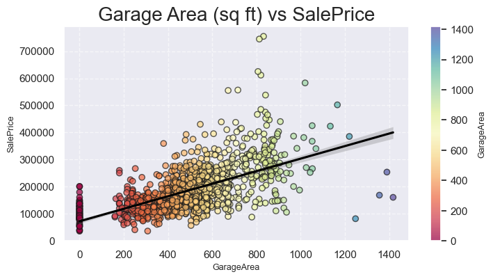
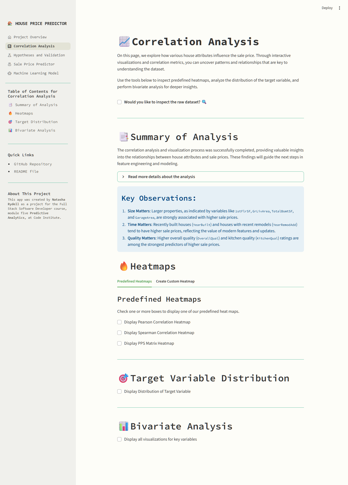
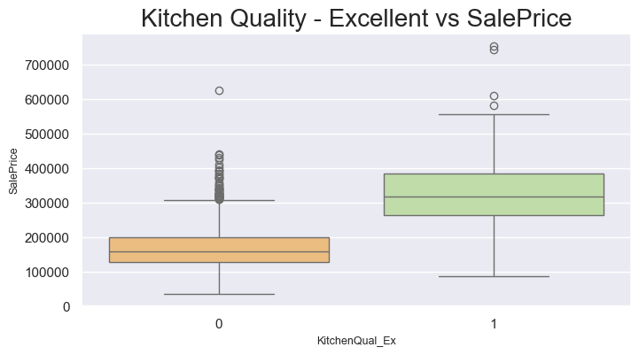
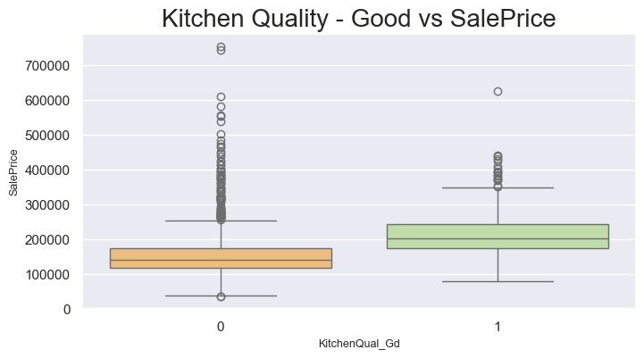
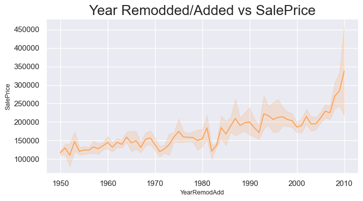
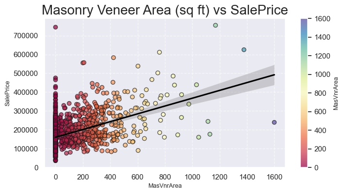

# House Pricing Predictor

# Site Overview

The **House Pricing Predictor** is an interactive dashboard designed to help users explore housing data from Ames, Iowa, and predict house sale prices. The dashboard provides:
- Insights into how house attributes correlate with sale prices.
- Real-time predictions for house sale prices based on user input.
- A technical overview of the machine learning model used for predictions.


[Link to Streamlit Dashboard](https://pp5-sales-price-predictor.onrender.com)

## Table of contents:
1. [**Site Overview**](#site-overview)
2. [**CRISP-DM**](#crisp-dm)
2. [**Dataset Content**](#dataset-content)
3. [**Business and Dashboard Requirements**](#business-and-dashboard-requirements)
4. [**Hypotheses and Validation Process**](#hypotheses-and-validation-process)
4. [**EPICS and User Stories**](#epics-and-user-stories)
5. [**Technical Implementation of Business Requirements**](#technical-implementation-of-business-requirements)
6. [**ML Business Case**](#ml-business-case)
7. [**Dashboard Design**](#dashboard-design)
	* [Sidebar](#sidebar)
    * [Quick Summary](#quick-summary)
    * [Correlation Analysis](#correlations-analysis)
    * [Hypotheses and Validation](#hypothesis-and-validation)
    * [Predict Sale Price](#predict-sale-price)
    * [Machine Learning Model](#machine-learning-model)
8. [**Plots**](#plots)
	* [Histogram](#histogram)
    * [Heatmaps](#heatmaps)
    * [Box Plots](#box-plots)
    * [Line Plots](#line-plots)
    * [Linear Model Plots](#linear-model-plots)
    * [Regresson Performance Plot](#regression-performance-plot)
9. [**Bugs**](#bugs)
	* [During Development](#during-development)
10. [**Project Testing**](#project-testing)
	* [PEP8 - CI Python Linter](#pep8---ci-python-linter)
    * [Manual Testing](#manual-testing)
    * [Unit Testing](#unit-testing)
	* [Notebook Testing](#notebook-testing)
11. [**Deployment**](#deployment)
12. [**Main Data Analysis and Machine Learning Libraries**](#main-data-analysis-and-machine-learning-libraries)
13. [**Credits**](#credits)
    * [Content](#content)
    * [Media](#media)
14. [**Acknowledgements**](#acknowledgements)

## CRISP-DM 
CRISP-DM (CRoss Industry Standard Process for Data Mining) is a standardized process model used to structure data analytics projects. It consists of six phases that help ensure that the project is well-organized and meets business requirements. In this project, CRISP-DM was applied as follows:

1. **Business Understanding**
	* **Objective**: Understand the client’s needs and define the business requirements. The client wants to:
		1. Identify which house attributes correlate most strongly with sales price.
		2. Predict the sales price of four inherited and second-hand houses in Ames, Iowa.
	* **Results**: The business requirements were mapped to two main tasks:
		* Perform data analysis and visualization to identify correlations.
		* Build a machine learning model to predict sales prices.

2. **Data Understanding**
	* **Objective**: Explore and understand the dataset.
	* **Actions**:
		* The dataset was downloaded from [Kaggle](https://www.kaggle.com/codeinstitute/housing-prices-data).
		* An initial analysis was performed to identify key variables and understand the data distribution.
	* **Results**: Variables such as `GrLivArea`, `GarageArea`, `KitchenQual`, and `OverallQual` were identified as potentially highly correlated with sales price.

3. **Data Preparation**
	* **Objective**: Prepare data for analysis and modeling.
	* **Actions**:
		* Handling missing values (e.g., imputation of `LotFrontage`).
		* Creation of new features (e.g., log-transformation of `SalePrice` to handle skew).
		* Splitting data into training and testing sets.
	* **Result**: A clean and structured dataset ready for analysis and modeling.

4. **Modeling**
	* **Objective**: Build and optimize a machine learning model.
	* **Actions**:
		* A regression model, **ExtraTreesRegressor**, was selected based on the business requirements and its ability to handle both linear and non-linear relationships.
		* Hyperparameter optimization was performed using GridSearchCV to improve the model’s performance.
		* The model was trained with the identified best features: `GarageArea`, `GrLivArea`, `KitchenQual` and `OverallQual`.
	* **Result**: 
		* R² (Train Set): 0.809
		* R² (Test Set): 0.793
		* The model has a good balance between bias and variance, indicating that it generalizes well to new data.

5. **Evaluation**
	* **Objective**: Evaluate the model’s performance and ensure that it meets the business requirements.
	* **Actions**:
		* The model’s performance was evaluated using R² scores and residual plots.
		* The results were compared with the customer’s requirement of an R² score of at least 0.75.
	* **Result**: The model met and exceeded the customer’s requirements.

6. **Deployment**
	* **Objective**: Deploy the solution to the customer.
	* **Actions**:
		* A Streamlit app was developed to visualize data and enable real-time predictions.
		* The app was deployed via [Render](https://render.com).
	* **Result**: The customer can now use the app to analyze data and predict sales prices.

## Dataset Content
* The dataset is sourced from [Kaggle](https://www.kaggle.com/codeinstitute/housing-prices-data). We then created a fictitious user story where predictive analytics can be applied in a real project in the workplace.
* The dataset has almost 1.5 thousand rows and represents housing records from Ames, Iowa, indicating house profile (Floor Area, Basement, Garage, Kitchen, Lot, Porch, Wood Deck, Year Built) and its respective sale price for houses built between 1872 and 2010.

|Variable|Meaning|Units|
|:----|:----|:----|
|1stFlrSF|First Floor square feet|334 - 4692|
|2ndFlrSF|Second-floor square feet|0 - 2065|
|BedroomAbvGr|Bedrooms above grade (does NOT include basement bedrooms)|0 - 8|
|BsmtExposure|Refers to walkout or garden level walls|Gd: Good Exposure; Av: Average Exposure; Mn: Minimum Exposure; No: No Exposure; None: No Basement|
|BsmtFinType1|Rating of basement finished area|GLQ: Good Living Quarters; ALQ: Average Living Quarters; BLQ: Below Average Living Quarters; Rec: Average Rec Room; LwQ: Low Quality; Unf: Unfinshed; None: No Basement|
|BsmtFinSF1|Type 1 finished square feet|0 - 5644|
|BsmtUnfSF|Unfinished square feet of basement area|0 - 2336|
|TotalBsmtSF|Total square feet of basement area|0 - 6110|
|GarageArea|Size of garage in square feet|0 - 1418|
|GarageFinish|Interior finish of the garage|Fin: Finished; RFn: Rough Finished; Unf: Unfinished; None: No Garage|
|GarageYrBlt|Year garage was built|1900 - 2010|
|GrLivArea|Above grade (ground) living area square feet|334 - 5642|
|KitchenQual|Kitchen quality|Ex: Excellent; Gd: Good; TA: Typical/Average; Fa: Fair; Po: Poor|
|LotArea| Lot size in square feet|1300 - 215245|
|LotFrontage| Linear feet of street connected to property|21 - 313|
|MasVnrArea|Masonry veneer area in square feet|0 - 1600|
|EnclosedPorch|Enclosed porch area in square feet|0 - 286|
|OpenPorchSF|Open porch area in square feet|0 - 547|
|OverallCond|Rates the overall condition of the house|10: Very Excellent; 9: Excellent; 8: Very Good; 7: Good; 6: Above Average; 5: Average; 4: Below Average; 3: Fair; 2: Poor; 1: Very Poor|
|OverallQual|Rates the overall material and finish of the house|10: Very Excellent; 9: Excellent; 8: Very Good; 7: Good; 6: Above Average; 5: Average; 4: Below Average; 3: Fair; 2: Poor; 1: Very Poor|
|WoodDeckSF|Wood deck area in square feet|0 - 736|
|YearBuilt|Original construction date|1872 - 2010|
|YearRemodAdd|Remodel date (same as construction date if no remodelling or additions)|1950 - 2010|
|SalePrice|Sale Price|34900 - 755000|


## Business and Dashboard Requirements
Our client has received an inheritance from a deceased great-grandfather located in Ames, Iowa, to  help in maximizing the sales price for the inherited properties.
Although your friend has an excellent understanding of property prices in her own state and residential area, she fears that basing her estimates for property worth on her current knowledge might lead to inaccurate appraisals. What makes a house desirable and valuable where she comes from might not be the same in Ames, Iowa. She found a public dataset with house prices for Ames, Iowa, and will provide you with that.

* **Business Requirement 1**: The client is interested in discovering how the house attributes correlate with the sale price. Therefore, the client expects data visualizations of the correlated variables against the sale price to show that.
* **Business requirement 2**: The client is interested in predicting the house sale price from her four inherited houses and any other houses in Ames, Iowa.
* **Dashboard Requirements**: The client requires a dashboard that provides an overview of the project and dataset, highlights key correlations between house attributes and sale prices, and allows users to input house data for real-time price predictions. It should also display the predicted sale price for the 4 inherited houses, their total value, and include a technical page summarizing the model's performance and pipeline.


## Hypotheses and Validation Process
To meet the business requirements, we have developed four hypotheses that examine how different house attributes affect sales price. These hypotheses are relevant to **Business Requirement 1** as they explore correlations and visualize the relationship between house attributes and sales price. They also support **Business Requirement 2** by identifying key variables for the regression model.

* **Hypothesis 1:**: Larger houses have higher sale price.
    * **Rationale**: It is expected that houses with larger living area (`GrLivArea`, `GarageArea`, `TotalBsmtSF`) have higher prices due to their size and usability.
    * **Validation**: 
		* A correlation analysis showed that `GrLivArea` has a strong positive correlation with sales price *(Pearson correlation: 0.71)*.
		* A scatterplot showed a clear trend where larger living area resulted in higher prices.

		

	* **Results**: The hypothesis was validated. `GrLivArea` is one of the most significant variables in predicting sales price.
	
* **Hypothesis 2**: Houses with higher overall quality have higher sale price.
    * **Rationale**: Houses with better construction quality and finish (`OverallQual`) are expected to have higher prices due to their durability, aesthetics and buyer appeal.
    * **Validation**: 
		* A correlation analysis showed that `OverallQual` has a very strong positive correlation with sales price *(Pearson correlation: 0.79)*.
		* A boxplot showed that houses with higher construction quality consistently had higher prices.

		

	* **Results**: The hypothesis was validated. `OverallQual` is one of the most decisive factors for the sales price.

* **Hypothesis 3**: Newer houses have higher sale price.
    * **Rationale**: Newer houses (`YearBuilt`) are expected to have higher prices due to modern design, better materials and lower maintenance costs.
    * **Validation**: 
		* A correlation analysis showed a positive correlation between `YearBuilt` and sales price *(Pearson correlation: 0.52)*.
		* A line plot showed that newer houses generally have higher prices.

		

	* **Results**: The hypothesis was partially validated. Although newer houses have higher prices, the correlation is not as strong as for other variables.

* **Hypothesis 4**: Houses with garages have higher sale price.
    * **Rationale**: Houses with garages (`GarageArea`) are more attractive because they offer extra storage and parking space, which increases value.
    * **Validation**: 
		* A scatterplot showed a positive trend between `GarageArea` and sales price *(Pearson correlation: 0.62)*.
		* Houses with larger garage areas generally had higher prices.

		

	* **Results**: The hypothesis was validated. `GarageArea` affects sales price, but not as strongly as `GrLivArea` or `OverallQual`.

## EPICS and User Stories
This project was developed by following a structured approach based on Epics and User Stories. Each Epic represents a major phase of the project, while the User Stories break down the tasks into actionable steps. All Epics and User Stories have been addressed throughout the project to ensure that the client's requirements are met.

You can find the detailed tracking and progress of these Epics and User Stories on GitHub: [Project Board on GitHub](https://github.com/users/NatashaRy/projects/4)

### **EPIC 1 - Information gathering and data collection**
* User Story (E1US01) - **As a data analyst**, I want to download the dataset from Kaggle so that I can start analyzing it.
* User Story (E1US02) - **As a data analyst**, I want to explore the structure of the dataset so that I can identify key variables. 
* User Story (E1US03) - **As a data analyst**, I want to document the business requirements so that I can ensure the project meets the client's need. 
 
### **EPIC 2 - Data visualization, cleaning and preparation**
* User story (E2US04) - **As a data analyst**, I want to clean the dataset by handling missing values and outliners so that it is ready for analysis.
* User story (E2US05) - **As a data analyst**, I want to perform a correlation analysis so that I can identify which variables have the most impact on the sale price. *(Business Requirement 1, Dashboard Requirements)*
* User story (E2US06) - **As a data scientist**, I want to create visualization of the correlations so that I can present insights to the user. *(Business Requirement 1, Dashboard Requirement)*

### **EPIC 3 - Model training, optimization and validation**
* User story (E3US07) - **As a data analyst**, I want to split the dataset into training and testing data so that I can evaluate the model's performance. 
* User story (E3US08) - **As a data analyst**, I want to build a regression model so that I can predict house prices. *(Business Requirement 2, Dashboard Requirement)*
* User story (E3US09) - **As a data analyst**, I want to optimize the model using hyperparameters tuning so that I can improve its performance. *(Business Requirement 2, Dashboard Requirement)*
* User story (E3US10) - **As a data analyst**, I want to evaluate the model using R² so that I can ensure it meets the performance requirements. *(Business Requirement 2, Dashboard Requirement)*

### **EPIC 4 - Dashboard planning, designing and development**
* User story (E4US11) - **As a user**, I want to see an overview page that describes the project and dataset so that I understand its purpose. *(Dashboard Requirement)*
* User story (E4US12) - **As a user**, I want to see which variables have the most impact on the sale price so that I can gain insights. *(Business Requirement 1, Dashboard Requirement)*
* User story (E4US13) - **As a user**, I want to input house data and get a real-time prediction of the sale price. *(Business Requirement 2, Dashboard Requirement)*
* User story (E4US14) - **As a user**, I want to see a technical page that shows the model's performance and pipeline so that I can understand how the model works. *(Business Requirement 2, Dashboard Requirement)*

### **EPIC 5 - Documentation and deployment**
* User story (E5US15) - **As a project reviewer**, I want to read a README.md file that decribes the project so that I can understand its purpose.


## Technical Implementation of Business Requirements
To address the client's business requirements, we have implemented specific data analysis and machine learning solutions. This section outlines the technical approach used to meet each requirement.

1. **Business Requirement 1**: Identify how house attributes correlate with the sale price.
	* **Rationale**: To understand which factors most influence the sale price, a detailed correlation analysis is required. This helps the client make informed decisions about which attributes are most valuable.
	* **Mapping**:
		* Perform correlation analysis between house attributes and sale price.
		* Visualize the correlations using scatter plots, box plots, and heatmaps.
		* Identify the most correlated variables and present them in an interactive dashboard.
    * **Notebook**: [03 - Correlation Analysis Notebook](https://github.com/NatashaRy/milestone-project-heritage-housing-issues/blob/main/jupyter_notebooks/03-CorrelationStudy.ipynb)
		
2. **Business Requirement 2**: Predict the sale price for the inherited houses and other houses in Ames, Iowa.
	**Rationale**: By building a machine learning model, we can provide the client with accurate sale price predictions based on house attributes. This helps the client maximize the value of the inherited houses.
	**Mapping**:
		* Train a regression model to predict sale prices.
		* Implement an interactive feature in the dashboard where users can input house attributes and get real-time predictions.
		* Display the predicted prices for the inherited houses and their total value.
    * **Notebook**: [05 - Model Training Notebook](https://github.com/NatashaRy/milestone-project-heritage-housing-issues/blob/main/jupyter_notebooks/05-ModelTraining.ipynb)
		
3. **Dashboard Requirements**:
	* **Rationale**: The dashboard serves as a central platform to present insights and predictions in a user-friendly way.
	* **Mapping**:
		* Create an overview page describing the project and dataset.
		* Implement pages for correlation analysis, hypothesis validation, and sale price predictions.
		* Include a technical page showing the model's performance and pipeline.


## ML Business Case
To meet the client's business requirements, we developed a machine learning solution using a regression model to predict sale prices based on house attributes. Below is a summary of the business case:

1. **Problem Definition**:
	* The client needs to understand which factors influence the sale price and predict the sale price for their inherited houses.
	* The challenge is that the client's current knowledge of property prices is insufficient for making accurate appraisals in Ames, Iowa.
2. **Objective**:
	* Identify the most relevant attributes that influence the sale price.
	* Build a machine learning model capable of predicting sale prices with high accuracy.
3. **Solution**:
	* Data Analysis: Perform correlation studies to identify the most relevant variables.
	* Feature Engineering: Prepare the dataset by handling missing values, outliers, and creating new features.
	* Model Training: Train a regression model (e.g., Random Forest or XGBoost) to predict sale prices.
	* Dashboard: Implementan interactive dashboard where users can explore insights and generate real-time predictions.
4. **Business Value**:
	* The client can make data-driven decisions about pricing and selling their inherited houses.
	* The dashboard provides a user-friendly platform to explore data and generate predictions, saving time and reducing uncertainty.
5. **Model Performance**:
	* The model is evaluated using R², MAE, and MSE to ensure it meets performance requirements.
	* A technical page in the dashboard displays the model's performance and the most important features influencing predictions.


## Dashboard Design
The dashboard for this project is built using Streamlit, an open-source Python library that allows for the rapid development of interactive web applications. Streamlit is particularly well-suited for data science and machine learning projects, as it enables seamless integration of data visualizations, widgets, and machine learning models into a user-friendly interface. The dashboard is designed to address the client's business requirements and provide actionable insights through interactive visualizations and predictive analytics.


### Sidebar

* **File name**: [`multipage.py`](https://github.com/NatashaRy/milestone-project-heritage-housing-issues/blob/main/app_pages/multipage.py)
* **Purpose**: The Streamlit Sidebar is designed to provide intuitive navigation and quick access to essential project details and features. It ensures that users can seamlessly explore the dashboard and interact with its functionalities. The sidebar is visible at all time.


**Content**:
* **Navigation**: Navigation with radio buttons to help user be able to switch between pages.
* **Expanding sidebar arrow**: The top right of the sidebar contains an arrow to give the user the possibility to fold/unfold the sidebar.

### Quick Summary
* **File name**: [`summary.py`](https://github.com/NatashaRy/milestone-project-heritage-housing-issues/blob/main/app_pages/summary.py)
* **Purpose**: Provide an overview of the project, including its goals, dataset and business requirements.
* **State Business Requirements**: A clear statement of the business requirements.
	1. Identify the most relevant variables correlated with house sale price.
	2. Predict the sale price of the 4 inherited houses and any other house in Amen, Iowa.


**Content**:
* **Introduction**: Summary of project and its goals.
* **Dataset Details**: Link to the Kaggle and quick summary of dataset listing:
	* Number of rows
	* Number of columns
	* Target varible
	* Key variables
	* Dataset preview
* **Business Requirements**: States the projects two business requirements. 
* **Link to README**: Link to README file at GitHub.
	
	
### Correlations Analysis
* **File name**: [`analysis.py`](https://github.com/NatashaRy/milestone-project-heritage-housing-issues/blob/main/app_pages/analysis.py)
* **Purpose**: Address Business Requirement 1 by analyzing and visualizing the correlation between house attributes and sale prices.
* **State Business Requirement 1**: Clearly outline the requirement to identify variables correlated with sale prices.

 

**Content**:
* **Introduciton**: 
	* Page introduction.
	* Reminder of business requriement 1. 
	* Checkbox to inspect raw dataset.
* **Conclusion**: 
	* Conclusion from correlation analysis with key observations.

  

   

* **Visualizations**:
	* **Heatmaps**: 
		* **Custom heatmap**: Dropdown to choose variables to correlate in heatmap.
		* **Predefined heatmaps**: Checkbox to for user to show Pearson correlation heatmap, Spearman correlation heatmap or PPS Matrix heatmap.
	* **Distribution of Target Variable**: Shows bar plot of feature importance. 
	* **Bivariate Analysis**: Displays a series of plots of key variables and SalePrice.


### Hypothesis and Validation
* **File name**: [`hypotheses.py`](https://github.com/NatashaRy/milestone-project-heritage-housing-issues/blob/main/app_pages/hypotheses.py)
* **Purpose**: Present the hypotheses formulated during the project and describe how they were validated.

 

**Content**:
* **Introduction**: 
	* Page introduction.
	* Summary of Findings.


* **Dropdown to choose one of the hypothesis**:
	1. Larger houses have higher sale price *- confirmed.*
	2. Houses with higher overall quality have higher sale price *- confirmed.*
	3. Newer houses have higher sale price *- confirmed.*
	4. Houses with garages have higher sale price *- confirmed.*
* **Returns choosen hypothesis**.

### Predict Sale Price
* **File name**: [`price_prediction.py`](https://github.com/NatashaRy/milestone-project-heritage-housing-issues/blob/main/app_pages/price_predictions.py)
* **Purpose**: Address Business Requirement 2 by providing predictions for the 4 inherited houses and allowing users to predict prices for other houses.
* **State Business Requirement 2**: Clearly outline the requirement to predict house sale prices.


**Content**:
* **Introduction**:
	* Page introduction.
	* Reminder of business requirement 2. 

* **Predict the sale price of inherited houses**:
	* Displays data of inherited houses in full width table, filtered with best features.
	* Displays predict sale price for inherited house in full width table.
	* Displays total predicted price of inherited houses.
	* Displays interactive bar chart of predicted sale price of the four inherited houses.
		* When hover over chart, box with price and house gets visible.

* **Prediction of sale price of your own house**: 
	* Widgets for users to input house attributes: 
		* `GarageArea`
		* `GrLivArea`
		* `KitchenQual` (1-5 scale)
		* `OverallQual` (1-10 scale)
	* A "Predict Pride" button to generate predictions for the entered attributes.
	* Qustionmark help at scale options explaining what each value equals:
		* 1 = Poor
		* 2 = Fair
		* 3 = Typical
		* 4 = Good
		* 5 = Excellent
	* Button labeled "Predict Price", to predict price based on user input.
	* Returns the predicted sale price based on the inputted house data from user.

### Machine Learning Model
* **File name**: [`ml_pipeline_predictions.py`](https://github.com/NatashaRy/milestone-project-heritage-housing-issues/blob/main/app_pages/ml_pipeline_prediction.py)
* **Purpose**: Provide an overview of the machine learning model's performance and technical implementation.


**Content**:
* **Introduction**: 
	* Page introduction.
	* Infobox with key performance metrics R² for Train and Test set. 
* **ML Pipeline**: 
	* Displays pipeline steps.
* **Feature Importance**: 
	* Highlight the most important features used by the model to make predictions.
	* Visualization of feature importance for featured variables.
* **Model Performance**:
	* Model Evaluation for Train and Test set. 
	* Displays performance score for each set separatly.
	* Scored displayed:
		* Mean Absolute Error (MAE)
		* Mean Squared Error (MSE)
		* Root Mean Squared Error (RMSE)
		* R² (R-squared)
* **Regression Evaluation Plots**:
	* Visualization that compares actual values and predictions on both Train and Test set side by side.

## Plots

### Histogram

The histogram shows the distribution of the sales prices (`SalePrice`) in the dataset. This gives an overview of how the prices are spread out and whether there are any clear peaks or outliers.


### Heatmaps

**Pearson Correlation Heatmap**: Visualizes linear relationships between variables and sales price. Higher values (close to 1 or -1) indicate strong relationships.


**Spearman Correlation Heatmap**: Visualizes the strong monotonic relationships.


**Predictive Power Score (PPS) Heatmap**: Shows the predictive strength between variables and the target variable (`SalePrice`), which is useful for identifying important predictors.


### Box Plots
Boxplots show how different categories (e.g. `KitchenQual` or `OverallQual`) affect the selling price. They help identify differences between groups.

*Price by Excellent Kitchen Quality*



*Price by Good Kitchen Quality*



*Price by Typical Kitchen Quality*


*Price by Overall Quality*


### Line Plots
The line charts show trends in sales prices over time, for example based on year built (`YearBuilt`) or year renovated (`YearRemodAdd`).

*Price by Year Built*


*Price by Year Remodeled/Added*




### Linear Model Plots
These charts show linear relationships between specific variables (e.g. `GrLivArea`, `GarageArea`) and sales price. They include a regression line to illustrate the trend.

*Price by First Floor Square Feet*


*Price by Garage Area*


*Price by Garage Year Built*


*Price by Ground Living Area*


*Price by Masonry Vaneer Area*



*Price by Total Basement Square Feet*


### Regression Performance Plot

Regression Performance Plot is a visualization that compares actual sales prices (`SalePrice`) to the predicted prices from your machine learning model.


## Bugs

### During Development
1. **Issue**: Errors occurred when processing the `GarageFinish` column due to missing values (NaN) and limitations of the `.csv` format.
	* **Cause**: 
		* `.csv` files do not preserve data types, causing `GarageFinish` to be read as `object` instead of `category`, leading to inefficiencies and errors.
		* Missing values (NaN) were inconsistently handled, resulting in unexpected behavior.
	* **Resolution**: Switched to `.parquet` files, which:
		* Preserve data types, ensuring GarageFinish remains as `category`.
		* Handle missing values (NaN) consistently.
		* Improve performance with faster read/write operations and smaller file sizes.


2. **Issue**: Multiple `FutureWarning` messages were triggered during development.
	* **Cause**: These warnings were caused by updates in libraries (e.g., pandas, Seaborn) that deprecated certain functions or changed their behavior, including:
		* Deprecation of `is_categorical_dtype`.
		* Deprecation of `DataFrame.applymap`.
		* Changes in Seaborn's handling of `palette` without `hue`.
		
		While these warnings indicate future changes, they do not affect the functionality or performance of the machine learning model.

	* **Resolution**: To suppress these non-critical warnings and maintain a clean console output, the following code was added:
	```
	# Import warnings
	Import warnings

	# Ignore FutureWarning
	warning.filterwarnings("ignore", category=FutureWarning)
	```

## Project Testing

### PEP8 - CI Python Linter
All Python project files were rigorously checked using the CI Python Linter, accessible at [PEP8CI](https://pep8ci.herokuapp.com/). 
This tool was employed to verify that the code complies with PEP 8 guidelines, promoting uniformity, clarity, and adherence to 
best practices throughout the project. The automated linting process identified and resolved formatting inconsistencies, 
ensuring a clean and professional codebase.

All `.py` files have been tested:
```
app.py 
multipage.py
summary.py
analysis.py
hypotheses.py
price_prediction.py
ml_pipeline_prediction.py	
prediction_analysis.py
evaluate_reg.py
data_management.py
```

### Manual Testing
The following tests were performed manually to ensure the functionality of the dashboard:
1. **Dataset Loading**: Verified that the dataset loads correctly without errors.
2. **Correlation Analysis**: Checked that the visualizations display the correct relationships between variables.
3. **Prediction Functionality**: Tested the prediction feature by inputting various house attributes and verifying the output.
4. **Dashboard Navigation**: Ensured that all pages in the dashboard are accessible and display the correct content.


### Unit Testing
Basic unit tests were performed for the machine learning model to ensure:
- The model trains without errors.
- Predictions are generated for valid input data.
- The model's performance metrics (R², MAE, MSE) meet the expected thresholds.

### Notebook Testing
To ensure that all steps in the Jupyter Notebook function correctly and produce the expected results, the following tests were conducted:
1. **Dataset Loading**: Verified that the dataset loads successfully and matches the expected structure (e.g., correct number of rows and columns).
2. **Data Cleaning**: Confirmed that missing values were handled correctly and outliers were addressed using the Winsorizer.
3. **Feature Engineering**: Ensured that transformations (e.g., log and power transformations) were applied correctly to the specified variables.
4. **Correlation Analysis**: Checked that correlation matrices and visualizations were generated without errors.
5. **Model Training**: Verified that the model was trained successfully using GridSearchCV and that the best hyperparameters were identified.
6. **Model Evaluation**: Confirmed that evaluation metrics (R², MAE, MSE) were calculated correctly and met performance expectations.
7. **Predictions**: Tested that predictions were generated correctly for both test data and user input.
8. **Visualizations**: Ensured that all visualizations (e.g., scatter plots, box plots, line plots) were displayed correctly and provided meaningful insights.
9. **Notebook Execution**: Verified that the entire notebook could be executed from start to finish without any errors.


## Deployment

### Render
* The App live link is: <https://pp5-sales-price-predictor.onrender.com/>
* The project was deployed to Render using the following steps.

1. Log in to [Render.com](#https://render.com) using GitHub.
2. Click on "New" button > "Web Service".
3. "Source Code" option: 
	1. Below "Git Provider" select "GitHub"
	2. Click on your GitHub username.
	3. Select "Only select repositories" > Select your repository name.
	4. Click "Install" > Verify account 
4. Select repository name at "Source Code!"
5. Choose a unique name for you web service.
6. Select language: `Python 3`.
7. Select branch: main.
8. Select region: Frankfurt (EU Central).
9. Set build command: `pip install -r requirement.txt && ./setup.sh
10. Set start command: `streamlit run app.py --server.port $PORT --server.address 0.0.0.0`, to ensure Streamlit is listening on the correct port.
11. Select instance type: Free (512 mb ram, 0.1 CPU)
12. Set environment variables: `Key: PYTHON_VERSION` `Value: 3.12.6`, follow Render's recommendation and get automatic patch updates
13. Click "Deploy Web Service".


## Main Data Analysis and Machine Learning Libraries
This section provides an overview of the key Python libraries and tools used in the project. Each library was chosen for its specific functionality and contribution to the development of the House Pricing Predictor. Below, we outline the purpose of each library and provide examples of how they were utilized in the project.

### Python Packages

#### **Web Application Framework**
* `Streamlit==1.40.3` - Used to create widgets for user input (e.g., sliders for house attributes) and to display interactive visualizations and prediction results.

#### **Data Manipulation and Analysis**
* `pandas==2.1.1` - Used to load the dataset, clean missing values, and perform exploratory data analysis (EDA). 
* `numpy==1.26.1` - Used for mathematical operations such as calculating correlation coefficients and handling large arrays efficiently.

#### **Data Visualization**
* `matplotlib==3.8.0` - Used to create scatter plots and bar charts for correlation analysis.
* `seaborn==0.13.2` - Used to create heatmaps for visualizing correlations between variables.
* `plotly==5.17.0` - Used to create dynamic visualizations in the dashboard, such as interactive scatter plots.

#### **Machine Learning and Model Training** 
* `scikit-learn==1.3.1` - Used to train regression models, evaluate their performance (e.g., R², MAE, MSE), and preprocess data using `StandardScaler`..
* `xgboost==1.7.6` - Used to train a high-performance regression model for predicting house prices.
* `feature-engine==1.6.1` - Used for encoding categorical variables, imputing missing values, and handling outliers with the `Winsorizer`.
* `imbalanced-learn==0.11.0` - Tools for handling imbalanced datasets.

#### **Data Analysis and Profiling**
* `ppscore==1.1.0` - Used during EDA to identify the most important predictors of house prices.
* `ydata-profiling==4.12.0` (Development only) - Used to create a detailed report of the dataset, including distributions, correlations, and missing values..

#### **Model Prersistence and File Operations**
* `joblib` (via scikit-learn) - The trained regression model was saved and loaded using joblib for deployment in the dashboard.
* `os` (Python Standard Library) - Used to dynamically load files and manage paths across different environments.
* `importlib` (Python Standard Library) - Used to load custom modules dynamically in the Streamlit app.

#### **Development and Debugging Tools**
* `warnings`(Python Standard Library) - Warnings related to deprecated features were suppressed during development.
* `re` (Python Standard Library) - Used to clean and preprocess text data in the dataset.

#### **Statistical Analysis**
* `scipy.stats`(via SciPy) - Used to calculate p-values and perform hypothesis testing during the validation process.

#### **Project Structure and Utilities**
* `multipage.py` (Custom module) - Used to organize the dashboard into separate pages for correlation analysis, predictions, and technical details.
* `data_management.py` (Custom module) - Used to load the dataset and cache it for faster access in the dashboard.
* `predictive_analysis.py`(Custom module) - Used to generate predictions for user-inputted house attributes.
* `evaluate_reg.py` (Custom module) - Used to calculate performance metrics such as R² and MAE for the trained models.


## Credits

* [**Co-Pilot**](https://code.visualstudio.com/docs/copilot/overview): I've frequently used Co-Pilot in VScode to help me solve problems when I've got stuck and also to double-check spelling and potential typos, as English is not my native language.
* [**Code Institute - Walkthrough Project 02 - Churnometer**](#https://learn.codeinstitute.net/courses/course-v1:CodeInstitute+DDA101+1/courseware/bba260bd5cc14e998b0d7e9b305d50ec/c83c55ea9f6c4e11969591e1b99c6c35/): Some code in steps [04 - Feature Engineering](https://github.com/NatashaRy/milestone-project-heritage-housing-issues/blob/main/jupyter_notebooks/04-FeatureEngineering.ipynb) and [05 - Model Training and Evaluation](https://github.com/NatashaRy/milestone-project-heritage-housing-issues/blob/main/jupyter_notebooks/05-ModelTraining.ipynb) I have fully or partially used or modified code from Walkthought project 2: Churnometer to move forward with my ML model.
* [**Abacus AI**](https://abacus.ai/): I've used Abacus AI, a platform created by Bindu Reddy, Arvind Sundararajan, and Siddartha Naidu, throughout the project to discuss and review my code. It was particularly helpful during the data cleaning phase, especially for handling `missing values` in `GarageFinish`, which led me to switch to the `parquet` file format for better compatibility.

### Content
* **Repository Template**: I've used the [repository template](https://github.com/Code-Institute-Solutions/milestone-project-heritage-housing-issues) provided by [Code Institute](https://codeinstitute.net) for this project. 

### Media

* **Screenshot of Streamlit Dashboard on different devices for README.md**: [AmIResponsive](https://ui.dev/amiresponsive)
* **Emojis on dashboard**: Windows emojis


## Acknowledgements

* My mentor **Mo Shami** for supporting and encurage me during this project, I wouldn't have gotten through this without him.
* I also want to thank my friends and family for supporting me and giving me the time I've needed to finish this project. 
